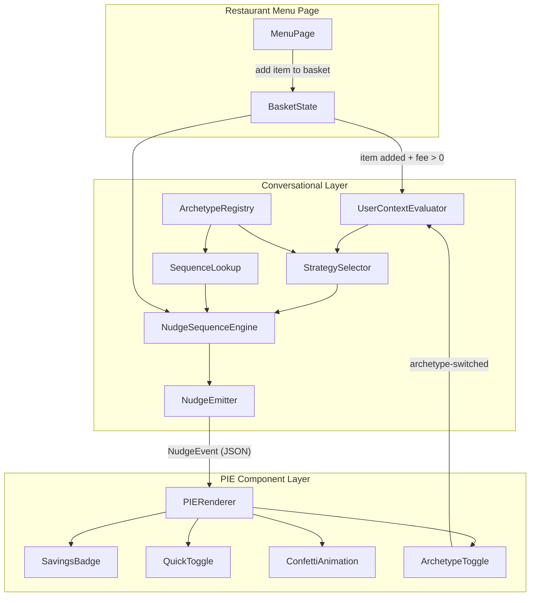

# Design Document: Conversational Nudge Layer

## Overview

This design describes a Conversational Nudge Layer for a food delivery checkout flow. The system is split into two decoupled layers:

1. **Conversational Layer** — a pure logic engine that evaluates user context (membership, fees, archetype), selects a behavioral strategy, and emits structured nudge events.
2. **PIE Component Layer** — a UI rendering layer that consumes UI directives from nudge events and renders dynamic components (badges, toggles, animations).

The two layers communicate exclusively through serializable JSON nudge events. This separation allows the conversational logic to be tested, replayed, and extended independently of any UI framework.

The user journey begins on a restaurant partner's menu page. When a non-member user adds a menu item to their basket and a delivery fee applies, the Conversational Layer is triggered to evaluate context and begin the nudge sequence. The system supports two archetypes: "Squeezed Saver" (Sam) with loss-aversion framing, and "Value Seeker" (Alex) with identity-reinforcement framing. Each archetype has its own 3-step checkout nudge sequence and a Subscription Upsell sequence triggered when monthly accumulated delivery fees exceed £10.00. An Archetype Toggle UI allows switching between archetypes to preview how messaging and PIE components change per persona.

### Technology Choices

- **Language**: TypeScript (strict mode)
- **UI Framework**: React (for PIE components)
- **Testing**: Vitest + fast-check (property-based testing)
- **Build**: Vite
- **State**: React context for basket state; the Conversational Layer is framework-agnostic (pure functions + classes)

### Key Design Decisions

| Decision | Rationale |
|---|---|
| Conversational Layer is framework-agnostic | Enables unit/property testing without DOM, supports future server-side evaluation |
| Nudge events are plain JSON objects | Enables serialization, logging, replay, and decoupled testing |
| Archetype registry pattern | New archetypes can be added via configuration without modifying core nudge logic |
| Nudge sequences are declarative data | Step definitions are data structures, not imperative code — easier to test and extend |
| fast-check for property testing | Mature PBT library for TypeScript with good generator support |
| Per-archetype nudge sequence definitions | Each archetype gets its own sequence data with archetype-appropriate templates and strategies — no conditional branching in the engine |
| Monthly accumulated fees in UserContext | Enables the Subscription Upsell trigger threshold check within the existing context evaluation pipeline |
| Archetype Toggle as a PIE component | Keeps the toggle within the PIE rendering layer; switching re-evaluates the full nudge pipeline from StrategySelector onward |

## Architecture



### Data Flow

1. User browses a restaurant partner's menu page and adds a menu item to the basket
2. The basket update triggers the `UserContextEvaluator`, which retrieves membership status, delivery fee, monthly accumulated fees, and archetype
3. If the user is a non-member with a delivery fee > £0.00, the `StrategySelector` picks a `BehavioralStrategy` based on archetype preferences
4. The `SequenceLookup` selects the appropriate `NudgeSequence` for the archetype (e.g., `squeezed-saver-checkout` or `value-seeker-checkout`). If monthly accumulated fees exceed £10.00, the Subscription Upsell sequence is selected instead
5. The `CheckoutNudgeController` evaluates the MOV gate: if `basketTotal < minimumOrderValue`, all nudge triggers are suppressed. This gate is checked before any other trigger conditions, including the Subscription Upsell threshold (Req 14.5)
6. `NudgeSequenceEngine` checks if the trigger condition for the current step is met
6. If met, `NudgeEmitter` produces a `NudgeEvent` (message + UI directive + metadata)
7. The PIE layer receives the event and renders the appropriate component alongside the basket/checkout UI
8. User interactions with PIE components (e.g., tapping the savings badge, toggling the trial) feed back as new trigger events to advance the sequence
9. If the user switches archetype via the `ArchetypeToggle`, the Conversational Layer re-evaluates from step 2 with the new archetype, and the PIE layer re-renders the current nudge step

## Components and Interfaces

### Conversational Layer Components

#### ArchetypeRegistry

Manages archetype definitions. Supports runtime registration of new archetypes.

```typescript
interface Archetype {
  name: string;
  traits: string[];
  preferredStrategies: BehavioralStrategyName[];
}

interface ArchetypeRegistry {
  register(archetype: Archetype): void;
  get(name: string): Archetype | undefined;
}
```

#### UserContextEvaluator

Retrieves and bundles user context for nudge decisions. Now includes `monthlyAccumulatedFees` for Subscription Upsell threshold evaluation and `basketTotal`/`minimumOrderValue` for the MOV gate (Req 14.3).

```typescript
interface UserContext {
  membershipStatus: 'member' | 'non-member';
  deliveryFee: number; // in pence, e.g. 399 = £3.99
  monthlyAccumulatedFees: number; // integer pence, total delivery fees this calendar month
  basketTotal: number; // integer pence, current basket total (sum of item prices × quantities)
  minimumOrderValue: number; // integer pence, restaurant's MOV (default 1500 = £15.00)
  archetype: Archetype | null;
}

interface UserContextEvaluator {
  evaluate(userId: string): UserContext;
}
```

#### StrategySelector

Selects the best behavioral strategy given an archetype and context.

```typescript
type BehavioralStrategyName = 'loss-aversion' | 'peak-end-rule' | 'identity-reinforcement';

interface StrategySelector {
  select(archetype: Archetype, context: UserContext): BehavioralStrategyName;
}
```

#### NudgeSequenceEngine

Tracks and advances through a nudge sequence.

```typescript
interface NudgeStep {
  stepId: string;
  trigger: TriggerCondition;
  messageTemplate: string;
  uiDirective: UIDirective;
  strategyOverride?: BehavioralStrategyName;
}

interface NudgeSequence {
  id: string;
  steps: NudgeStep[];
}

type TriggerCondition =
  | { type: 'item-added-to-basket'; feeGreaterThan: number }
  | { type: 'checkout-reached'; feeGreaterThan: number }
  | { type: 'nudge-tapped'; stepId: string }
  | { type: 'trial-activated' }
  | { type: 'subscription-upsell'; monthlyFeesExceed: number };

interface NudgeSequenceEngine {
  load(sequence: NudgeSequence): void;
  getCurrentStep(): NudgeStep | null;
  advance(trigger: TriggerCondition): NudgeEvent | null;
  reset(): void;
  isComplete(): boolean;
}
```

#### NudgeEvent (emitted output)

```typescript
interface UIDirective {
  componentType: string; // e.g. 'savings-badge', 'quick-toggle', 'confetti'
  targetSelector?: string;
  props: Record<string, unknown>;
}

interface NudgeEvent {
  stepId: string;
  message: string;
  uiDirective: UIDirective;
  timestamp: string; // ISO 8601
  metadata: {
    archetypeName: string;
    strategyName: BehavioralStrategyName;
  };
}
```

### PIE Component Layer

#### PIERenderer

Maps `UIDirective.componentType` to a React component and renders it.

```typescript
interface PIEComponentProps {
  directive: UIDirective;
  onInteraction?: (event: PIEInteractionEvent) => void;
}

interface PIEInteractionEvent {
  componentType: string;
  action: string; // e.g. 'tapped', 'toggled-on'
  payload?: Record<string, unknown>;
}

interface PIERenderer {
  registerComponent(type: string, component: React.ComponentType<PIEComponentProps>): void;
  render(directive: UIDirective): React.ReactElement | null;
}
```

#### Concrete PIE Components

| Component | componentType | Key Props | Interaction |
|---|---|---|---|
| SavingsBadge | `savings-badge` | `position`, `animationType` (`vibrate`) | `tapped` |
| QuickToggle | `quick-toggle` | `label`, `savingsAmount`, `trialDuration` | `toggled-on` |
| ConfettiAnimation | `confetti` | `targetSelector`, `duration` | none (fire-and-forget) |
| ArchetypeToggle | `archetype-toggle` | `archetypes` (string[]), `activeArchetype` | `archetype-switched` with `{ archetype: string }` payload |


## Data Models

### Archetype Definition

```typescript
interface Archetype {
  name: string;                              // e.g. "squeezed-saver"
  traits: string[];                          // e.g. ["cost-conscious", "deal-seeking"]
  preferredStrategies: BehavioralStrategyName[]; // ordered by priority
}
```

**Squeezed Saver default:**
```json
{
  "name": "squeezed-saver",
  "traits": ["cost-conscious", "deal-seeking", "fee-averse"],
  "preferredStrategies": ["loss-aversion", "peak-end-rule", "identity-reinforcement"]
}
```

**Value Seeker default:**
```json
{
  "name": "value-seeker",
  "traits": ["optimization-driven", "data-responsive", "exclusivity-motivated"],
  "preferredStrategies": ["identity-reinforcement", "loss-aversion", "peak-end-rule"]
}
```

The Value Seeker archetype prioritizes `identity-reinforcement` as its first strategy, producing messaging that emphasizes data-backed savings figures and exclusive member-only benefits (Req 10.1, 10.3).

### User Context

```typescript
interface UserContext {
  membershipStatus: 'member' | 'non-member';
  deliveryFee: number;       // integer pence (e.g. 399 = £3.99)
  monthlyAccumulatedFees: number; // integer pence, total delivery fees paid this calendar month
  basketTotal: number;       // integer pence, current basket total (sum of item prices × quantities)
  minimumOrderValue: number; // integer pence, restaurant's MOV (default 1500 = £15.00)
  archetype: Archetype | null;
}
```

Delivery fee is stored as integer pence to avoid floating-point rounding issues in currency calculations. `monthlyAccumulatedFees` tracks the running total of delivery fees the user has paid in the current calendar month, used as the threshold condition for the Subscription Upsell intent (Req 11.1, 11.2). `basketTotal` is the sum of all item prices × quantities in the current basket. `minimumOrderValue` is the restaurant's minimum order value, defaulting to 1500 pence (£15.00) when the restaurant does not specify one (Req 14.3). The MOV gate suppresses all nudge triggers while `basketTotal < minimumOrderValue` (Req 14.1, 14.5).

### Nudge Sequence Definition

```typescript
interface NudgeStep {
  stepId: string;
  trigger: TriggerCondition;
  messageTemplate: string;       // supports {{fee}}, {{trialDuration}}, {{savings}}, {{userName}}, {{accumulatedFees}}, {{currentOrderSavings}} placeholders
  uiDirective: UIDirective;
  strategyOverride?: BehavioralStrategyName;
}

interface NudgeSequence {
  id: string;
  steps: NudgeStep[];
}
```

### Nudge Event (serialized output)

```typescript
interface NudgeEvent {
  stepId: string;
  message: string;               // resolved message (placeholders filled)
  uiDirective: UIDirective;
  timestamp: string;             // ISO 8601
  metadata: {
    archetypeName: string;
    strategyName: BehavioralStrategyName;
  };
}
```

### UI Directive

```typescript
interface UIDirective {
  componentType: string;
  targetSelector?: string;
  props: Record<string, unknown>;
}
```

### Basket State

```typescript
interface BasketState {
  items: BasketItem[];
  deliveryFee: number;           // integer pence
  membershipStatus: 'member' | 'non-member';
  trialActive: boolean;
}

interface BasketItem {
  id: string;
  name: string;
  price: number;                 // integer pence
  quantity: number;
}
```

### Checkout Nudge Sequence (Squeezed Saver)

The 3-step sequence for the initial prototype:

| Step | stepId | Trigger | Strategy | UI Directive |
|---|---|---|---|---|
| 1 | `savings-alert` | `item-added-to-basket` with fee > 0 | loss-aversion | `savings-badge` with vibrate |
| 2 | `trial-offer` | `nudge-tapped` on `savings-alert` | loss-aversion | `quick-toggle` |
| 3 | `delight-confirm` | `trial-activated` | peak-end-rule | `confetti` |

The nudge sequence is triggered when a user adds a menu item to their basket from a restaurant partner's menu page, rather than waiting until the checkout screen. This earlier intervention point catches the user at the moment they commit to an order, when the delivery fee first becomes visible and loss-aversion framing is most effective.

### Checkout Nudge Sequence (Value Seeker)

The 3-step sequence for the Value Seeker archetype uses identity-reinforcement framing:

| Step | stepId | Trigger | Strategy | UI Directive |
|---|---|---|---|---|
| 1 | `savings-alert` | `item-added-to-basket` with fee > 0 | identity-reinforcement | `savings-badge` with vibrate |
| 2 | `trial-offer` | `nudge-tapped` on `savings-alert` | identity-reinforcement | `quick-toggle` |
| 3 | `delight-confirm` | `trial-activated` | peak-end-rule | `confetti` |

The Value Seeker sequence mirrors the Squeezed Saver structure but uses identity-reinforcement message templates that emphasize optimization, data-backed savings, and exclusive member benefits.

### Subscription Upsell Nudge Sequence (Squeezed Saver)

Triggered when a non-member at checkout has `monthlyAccumulatedFees > 1000` (£10.00). Uses loss-aversion framing with "convenience tax" messaging.

| Step | stepId | Trigger | Strategy | Message Template |
|---|---|---|---|---|
| 1 | `upsell-alert` | `subscription-upsell` with monthlyFeesExceed > 1000 | loss-aversion | "Hey {{userName}}, I noticed you've spent {{accumulatedFees}} on delivery fees lately. That's a massive 'convenience tax.' Let's wipe that out—join JET+ for free for 14 days and save {{currentOrderSavings}} on this order right now" |
| 2 | `upsell-offer` | `nudge-tapped` on `upsell-alert` | loss-aversion | `quick-toggle` |
| 3 | `upsell-confirm` | `trial-activated` | peak-end-rule | `confetti` |

### Subscription Upsell Nudge Sequence (Value Seeker)

Triggered under the same conditions as the Squeezed Saver upsell. Uses identity-reinforcement framing with optimization and exclusivity messaging.

| Step | stepId | Trigger | Strategy | Message Template |
|---|---|---|---|---|
| 1 | `upsell-alert` | `subscription-upsell` with monthlyFeesExceed > 1000 | identity-reinforcement | "Ready to optimize, {{userName}}? Most JET+ members save over £20 a month. Start your trial now to get this delivery for £0.00 and unlock exclusive member-only offers" |
| 2 | `upsell-offer` | `nudge-tapped` on `upsell-alert` | identity-reinforcement | `quick-toggle` |
| 3 | `upsell-confirm` | `trial-activated` | peak-end-rule | `confetti` |

### Template Variables

All nudge message templates support the following placeholder variables, resolved at emit time by the template resolver:

| Variable | Source | Description |
|---|---|---|
| `{{fee}}` | `UserContext.deliveryFee` | Current order delivery fee formatted as £X.XX |
| `{{savings}}` | `UserContext.deliveryFee` | Savings amount (equal to fee for trial activation) |
| `{{trialDuration}}` | Configuration | Trial period (e.g., "14 days", "30-day") |
| `{{userName}}` | User profile | User's first name (e.g., "Sam", "Alex") |
| `{{accumulatedFees}}` | `UserContext.monthlyAccumulatedFees` | Monthly accumulated fees formatted as £X.XX |
| `{{currentOrderSavings}}` | `UserContext.deliveryFee` | Savings on the current order formatted as £X.XX |

### Sequence Lookup

The `CheckoutNudgeController` selects the appropriate sequence based on archetype name and whether the Subscription Upsell threshold is met:

1. If `monthlyAccumulatedFees > 1000` and user is `non-member` → select the archetype's Subscription Upsell sequence
2. Otherwise → select the archetype's standard checkout sequence

Each archetype has its own pair of sequences (checkout + upsell), registered as declarative data. No conditional branching in the engine itself.

### Minimum Order Value (MOV) Gate

The `CheckoutNudgeController` enforces a Minimum Order Value gate before evaluating any nudge trigger conditions (Req 14.1–14.5):

1. During `initialize()`, the controller stores `basketTotal` and `minimumOrderValue` from the `UserContext`
2. Before any trigger method (`handleItemAdded`, `handleCheckout`, `handleSubscriptionUpsell`, `handleInteraction`, `triggerFirstStep`) advances the sequence, the controller checks: `basketTotal < minimumOrderValue`
3. If the basket total is below the MOV, the method returns `null` — no nudge is emitted
4. If the basket total meets or exceeds the MOV, trigger evaluation proceeds as normal
5. The MOV gate is the first check, evaluated before the Subscription Upsell threshold and all other trigger conditions (Req 14.5)
6. If the basket total drops below the MOV mid-sequence (e.g., user removes items), further nudge steps are suppressed until the basket total meets or exceeds the MOV again (Req 14.4). The controller exposes an `updateBasketTotal(newTotal: number)` method for the UI layer to call when the basket changes
7. The restaurant's MOV defaults to 1500 pence (£15.00) when not specified (Req 14.3)

```typescript
// Pseudocode for MOV gate in CheckoutNudgeController
private basketTotal: number = 0;
private minimumOrderValue: number = 1500; // default £15.00

private isMovMet(): boolean {
  return this.basketTotal >= this.minimumOrderValue;
}

// Called at the start of every trigger method:
// if (!this.isMovMet()) return null;
```


## Correctness Properties

*A property is a characteristic or behavior that should hold true across all valid executions of a system — essentially, a formal statement about what the system should do. Properties serve as the bridge between human-readable specifications and machine-verifiable correctness guarantees.*

### Property 1: Archetype registry round-trip

*For any* valid Archetype definition (with a name, traits list, and preferred strategies list), registering it in the ArchetypeRegistry and then retrieving it by name should produce an equivalent Archetype object.

**Validates: Requirements 2.1**

### Property 2: Strategy selection stays within archetype preferences

*For any* Archetype with a non-empty preferred strategies list and *for any* valid UserContext, the StrategySelector should return a BehavioralStrategyName that is contained in the Archetype's preferredStrategies list.

**Validates: Requirements 1.2, 2.3**

### Property 3: Context evaluator returns complete context

*For any* user ID with backing data, the UserContextEvaluator should return a UserContext where membershipStatus is either 'member' or 'non-member', deliveryFee is a non-negative integer, monthlyAccumulatedFees is a non-negative integer, basketTotal is a non-negative integer, minimumOrderValue is a positive integer (defaulting to 1500 when unspecified), and archetype is either a valid Archetype object or null.

**Validates: Requirements 1.1, 11.2, 14.3**

### Property 4: Sequence engine advances only on matching trigger

*For any* NudgeSequence with N steps and *for any* step index i (0 ≤ i < N), the engine should emit a NudgeEvent only when the provided trigger matches the current step's trigger condition, and after emission the engine should advance to step i+1. Providing a non-matching trigger should return null and leave the current step unchanged.

**Validates: Requirements 3.2, 3.3**

### Property 5: Sequence reset restores initial state

*For any* NudgeSequence and *for any* number of successful advances (0 to N), calling reset should return the engine to step 0 with no steps completed, equivalent to a freshly loaded sequence.

**Validates: Requirements 3.4**

### Property 6: Template resolution includes all context values

*For any* message template containing placeholders (e.g., `{{fee}}`, `{{trialDuration}}`, `{{savings}}`, `{{userName}}`, `{{accumulatedFees}}`, `{{currentOrderSavings}}`) and *for any* valid context values for those placeholders, the resolved message should contain the string representation of each context value and contain no unresolved `{{...}}` placeholders.

**Validates: Requirements 4.3, 5.3, 12.3**

### Property 7: NudgeEvent structural completeness

*For any* NudgeEvent emitted by the Conversational Layer, the event should contain a non-empty stepId string, a non-empty message string, a UIDirective object with a non-empty componentType, a valid ISO 8601 timestamp, and a metadata object with non-empty archetypeName and strategyName fields.

**Validates: Requirements 7.1, 9.1, 9.3**

### Property 8: NudgeEvent JSON serialization round-trip

*For any* valid NudgeEvent, serializing it to JSON via `JSON.stringify` and then deserializing via `JSON.parse` should produce an object deeply equal to the original NudgeEvent.

**Validates: Requirements 9.2**

### Property 9: Trial activation zeroes delivery fee

*For any* BasketState with a positive delivery fee and trialActive set to false, activating the trial (setting trialActive to true) and processing the Step 3 nudge should result in the basket's deliveryFee being 0.

**Validates: Requirements 6.3**

### Property 10: Unknown PIE component type produces null

*For any* UIDirective whose componentType is not registered in the PIERenderer, calling render should return null (and not throw).

**Validates: Requirements 8.4**

### Property 11: Multiple archetypes coexist in registry

*For any* set of distinct Archetype definitions registered in the ArchetypeRegistry, retrieving any previously registered archetype by name should return the original definition unchanged, regardless of how many other archetypes were registered after it.

**Validates: Requirements 10.2, 2.4**

### Property 12: Subscription upsell threshold triggers correctly

*For any* UserContext where membershipStatus is 'non-member', the Subscription Upsell nudge sequence should be triggered if and only if monthlyAccumulatedFees exceeds 1000 (£10.00). When monthlyAccumulatedFees is ≤ 1000 or membershipStatus is 'member', the upsell sequence should not be triggered.

**Validates: Requirements 11.1, 11.3**

### Property 13: Upsell message contains resolved archetype-specific template variables

*For any* archetype triggering a Subscription Upsell nudge, the emitted NudgeEvent message should contain the resolved values of userName, accumulatedFees, and currentOrderSavings template variables, with no unresolved placeholders remaining.

**Validates: Requirements 12.1, 12.2, 12.3**

### Property 14: Archetype switch re-evaluates nudge sequence

*For any* two distinct registered archetypes, switching from one to the other via the ArchetypeToggle should cause the Conversational Layer to produce a NudgeEvent whose metadata.strategyName matches the newly selected archetype's first preferred strategy, and whose message reflects the new archetype's message template.

**Validates: Requirements 13.2**

### Property 15: MOV gate suppresses nudges when basket total is below minimum order value

*For any* valid UserContext where `basketTotal < minimumOrderValue`, all nudge trigger methods (`handleItemAdded`, `handleCheckout`, `handleSubscriptionUpsell`, `handleInteraction`, `triggerFirstStep`) should return `null` and not advance the sequence. *For any* valid UserContext where `basketTotal >= minimumOrderValue`, nudge trigger methods should evaluate trigger conditions as normal.

**Validates: Requirements 14.1, 14.2, 14.5**

## Error Handling

### Conversational Layer Errors

| Scenario | Handling |
|---|---|
| Archetype not found for user | `UserContextEvaluator` returns `archetype: null`. Downstream logic emits no nudges (Req 1.3). |
| Membership status unavailable | `UserContextEvaluator` returns `archetype: null`, triggering fallback (Req 1.3). |
| Empty preferred strategies list | `StrategySelector` returns `undefined`. No nudge is emitted for that step. |
| Trigger provided for wrong step | `NudgeSequenceEngine.advance()` returns `null`. No state change. |
| Sequence already complete | `advance()` returns `null`. `isComplete()` returns `true`. |
| Invalid template placeholder | Unresolved placeholders are left as-is in the message string. Logged as a warning. |
| Monthly accumulated fees unavailable | `UserContextEvaluator` returns `monthlyAccumulatedFees: 0`. Subscription Upsell threshold not met, standard checkout sequence used. |
| No sequence found for archetype | `CheckoutNudgeController` returns `null` from `initialize()`. No nudges emitted. |
| Minimum order value unavailable | `UserContextEvaluator` returns `minimumOrderValue: 1500` (default £15.00). MOV gate uses the default. |
| Basket total drops below MOV mid-sequence | `CheckoutNudgeController` suppresses further nudge steps. Sequence position is preserved; nudges resume when basket total meets or exceeds MOV again (Req 14.4). |
| Archetype switch to unknown archetype | `ArchetypeToggle` interaction ignored. Current archetype and sequence remain active. Logged as a warning. |

### PIE Component Layer Errors

| Scenario | Handling |
|---|---|
| Unknown componentType in UIDirective | `PIERenderer.render()` returns `null` and logs a warning (Req 8.4). |
| Missing required props | Component renders in a safe default state. Logged as a warning. |
| Confetti target element not found | Animation is skipped silently. Logged as a warning. |

### General Principles

- The Conversational Layer never throws exceptions to the UI layer. All errors result in "no nudge" or "null" returns.
- All error conditions are logged with structured context (stepId, componentType, etc.) for debugging.
- The PIE layer treats all directives as best-effort: render if possible, skip gracefully if not.

## Testing Strategy

### Dual Testing Approach

Testing uses two complementary strategies:

1. **Unit tests** (Vitest) — verify specific examples, edge cases, and integration points
2. **Property-based tests** (Vitest + fast-check) — verify universal properties across randomly generated inputs

### Unit Tests

Unit tests cover:

- **Specific examples**: The 3-step Squeezed Saver checkout flow end-to-end (Req 4.1, 4.2, 5.1, 5.2, 6.1, 6.2)
- **Specific examples**: The 3-step Value Seeker checkout flow end-to-end with identity-reinforcement messaging (Req 10.1, 10.3)
- **Specific examples**: Subscription Upsell flow for Squeezed Saver with "convenience tax" framing (Req 12.1)
- **Specific examples**: Subscription Upsell flow for Value Seeker with "optimize and unlock exclusives" framing (Req 12.2)
- **Edge cases**: Null archetype fallback (Req 1.3), checkout abandonment reset (Req 3.4), unknown PIE component warning (Req 8.4)
- **Edge cases**: Monthly accumulated fees at exactly £10.00 boundary (Req 11.1, 11.3)
- **Edge cases**: Basket total at exactly MOV boundary (Req 14.1, 14.2), basket dropping below MOV mid-sequence (Req 14.4), MOV gate checked before upsell threshold (Req 14.5)
- **PIE component rendering**: SavingsBadge renders with position/animation props (Req 8.1), QuickToggle fires callback on activation (Req 8.2), ConfettiAnimation triggers on target (Req 8.3)
- **PIE component rendering**: ArchetypeToggle renders all registered archetypes, displays active archetype, fires `archetype-switched` event (Req 13.1, 13.3, 13.4)
- **Integration**: Full flow from UserContextEvaluator → StrategySelector → NudgeSequenceEngine → NudgeEvent → PIERenderer
- **Integration**: Archetype switch re-renders PIE components with new messaging (Req 13.3)

### Property-Based Tests

Each correctness property from the design is implemented as a single property-based test using fast-check with a minimum of 100 iterations.

Each test is tagged with a comment referencing the design property:

```typescript
// Feature: conversational-nudge-layer, Property 1: Archetype registry round-trip
```

| Property | Generator Strategy |
|---|---|
| P1: Archetype registry round-trip | Generate random archetype names, trait arrays, and strategy lists |
| P2: Strategy selection within preferences | Generate random archetypes with non-empty strategy lists + random contexts |
| P3: Context evaluator completeness | Generate random user IDs with random backing data including monthlyAccumulatedFees |
| P4: Sequence advance on matching trigger | Generate random sequences (1-10 steps) with random triggers |
| P5: Sequence reset | Generate random sequences, advance 0-N steps, then reset |
| P6: Template resolution | Generate templates with random placeholders (including userName, accumulatedFees, currentOrderSavings) and random context values |
| P7: NudgeEvent structural completeness | Generate random valid nudge events and validate schema |
| P8: NudgeEvent JSON round-trip | Generate random valid nudge events, serialize/deserialize |
| P9: Trial activation zeroes fee | Generate random basket states with positive fees |
| P10: Unknown PIE component type | Generate random non-registered component type strings |
| P11: Multiple archetypes coexist | Generate random sets of 2-10 archetypes, register all, verify each retrieval |
| P12: Subscription upsell threshold | Generate random UserContexts with varying monthlyAccumulatedFees and membershipStatus, verify upsell triggers iff fees > 1000 and non-member |
| P13: Upsell message template variables | Generate random archetype names, user names, fee amounts; verify emitted message contains all resolved values |
| P14: Archetype switch re-evaluates | Generate pairs of distinct archetypes with different preferred strategies; verify switch produces events with new strategy |
| P15: MOV gate suppresses nudges | Generate random UserContexts with varying basketTotal and minimumOrderValue; verify all trigger methods return null when basketTotal < minimumOrderValue, and evaluate normally when basketTotal >= minimumOrderValue |

### Test Configuration

- **Framework**: Vitest
- **PBT Library**: fast-check (do not implement PBT from scratch)
- **Minimum iterations**: 100 per property test
- **Tag format**: `Feature: conversational-nudge-layer, Property {N}: {title}`
