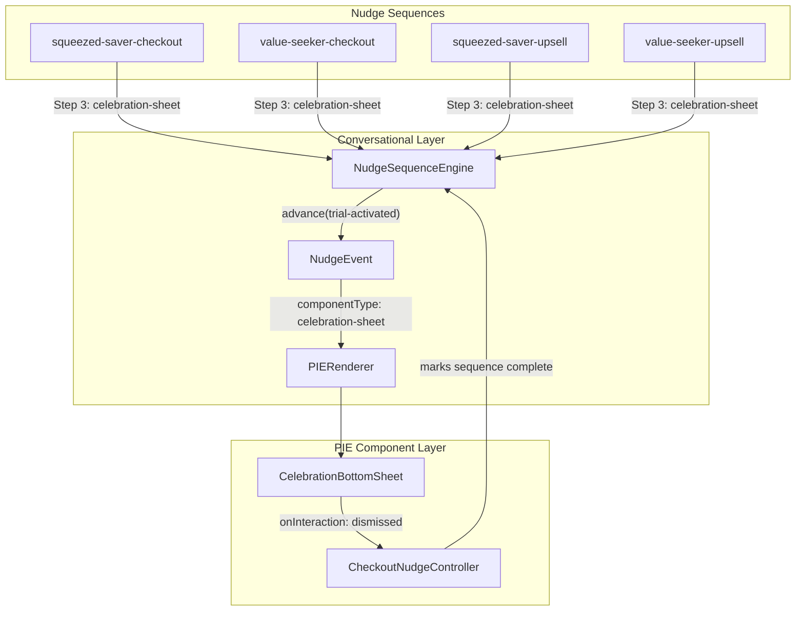

# Design Document: Free Trial Activation Screen

## Overview

This design describes a Celebration Bottom Sheet that replaces the current Step 3 (delight-confirm / upsell-confirm) confetti-only experience across all four nudge sequences. When a user activates a free trial via the Quick-Toggle, the system now presents a rich confirmation bottom sheet instead of a bare confetti animation.

The Celebration Bottom Sheet is a modal overlay that slides up from the bottom of the viewport. It contains:
- A header with a background image, confetti streamers overlay, and JET+ logo
- A "Welcome to Just Eat+" title in ExtraBlack Italic 32px/36px
- An archetype-specific body message (loss-aversion for Sam, identity-reinforcement for Alex)
- A Trial Active Indicator showing "JET+ trial active" and "Delivery fee removed"
- A pull-tab indicator and backdrop overlay

The sheet auto-dismisses after a configurable duration (default 4000ms) and fires a "dismissed" interaction event so the Conversational Layer can finalize the nudge sequence. Users can also dismiss early via backdrop tap or Escape key.

### Technology Choices

- **Language**: TypeScript (strict mode)
- **UI Framework**: React (CelebrationBottomSheet is a PIE component)
- **Testing**: Vitest + fast-check
- **Assets**: Figma MCP asset URLs for background, confetti, logo, and check-circle icon

### Key Design Decisions

| Decision | Rationale |
|---|---|
| New PIE component rather than extending ConfettiAnimation | The celebration sheet is a fundamentally different UI pattern (modal dialog vs. fire-and-forget animation). Separate component keeps each focused. |
| componentType `"celebration-sheet"` | Distinct from `"confetti"` so the PIERenderer routes to the correct component. Existing confetti component remains available for other uses. |
| Auto-dismiss with configurable duration | Matches the fire-and-forget pattern of the existing confetti but adds a richer experience. Default 4000ms gives enough time to read the confirmation. |
| "dismissed" interaction event | Reuses the existing `PIEInteractionEvent` pattern. The controller maps this to sequence completion, same as how `toggled-on` maps to `trial-activated`. |
| Same visual layout for both archetypes, varying only body message | Keeps the component simple — archetype differentiation is handled by the Conversational Layer's message template, not by conditional rendering in the PIE component. |
| Inline styles following NudgeBottomSheet pattern | Consistent with the existing NudgeBottomSheet.tsx approach. No external CSS dependencies. |
| Focus management on open/close | Required for accessibility (role="dialog", aria-modal). Follows the same pattern as NudgeBottomSheet. |

## Architecture



### Data Flow

1. User activates trial via Quick-Toggle, fires `toggled-on` interaction event
2. `CheckoutNudgeController.handleInteraction` maps `toggled-on` to `trial-activated` trigger
3. `NudgeSequenceEngine.advance` matches the Step 3 trigger and emits a `NudgeEvent` with `componentType: "celebration-sheet"`
4. `PIERenderer` looks up `"celebration-sheet"` in the registry and renders `CelebrationBottomSheet`
5. The component displays the celebration UI with archetype-specific body message
6. After `autoDismissDuration` ms (or user dismissal), the component fires `{ componentType: "celebration-sheet", action: "dismissed" }` via `onInteraction`
7. `CheckoutNudgeController` receives the interaction; the sequence is now complete

### Integration Points

The changes touch three areas:

1. **New PIE component**: `src/pie/CelebrationBottomSheet.tsx`
2. **Sequence definitions**: Update all 4 sequences in `src/conversational/sequences/` to use `componentType: "celebration-sheet"` for Step 3
3. **CheckoutPage.tsx**: Register `CelebrationBottomSheet` under `"celebration-sheet"` in the PIERenderer, and map the `"dismissed"` interaction to sequence completion

## Components and Interfaces

### CelebrationBottomSheet (PIE Component)

```typescript
// Registered as componentType: "celebration-sheet"
// Props extracted from UIDirective.props:
interface CelebrationSheetDirectiveProps {
  welcomeTitle: string;        // e.g. "Welcome to Just Eat+"
  bodyMessage: string;         // Resolved archetype-specific message
  autoDismissDuration: number; // ms, default 4000
  archetypeName: string;       // "squeezed-saver" or "value-seeker"
}
```

The component receives the standard `PIEComponentProps` interface:

```typescript
interface PIEComponentProps {
  directive: UIDirective;
  onInteraction?: (event: PIEInteractionEvent) => void;
}
```

Interaction event emitted on dismiss:

```typescript
{
  componentType: "celebration-sheet",
  action: "dismissed"
}
```

### Updated UIDirective for Step 3

```typescript
// Before (confetti):
{
  componentType: 'confetti',
  targetSelector: '.delivery-fee-line',
  props: { duration: 3000 }
}

// After (celebration-sheet):
{
  componentType: 'celebration-sheet',
  props: {
    welcomeTitle: 'Welcome to Just Eat+',
    bodyMessage: '<resolved archetype message>',
    autoDismissDuration: 4000,
    archetypeName: 'squeezed-saver' // or 'value-seeker'
  }
}
```

### CheckoutNudgeController Changes

The controller's `mapInteractionToTrigger` method needs a new mapping:

```typescript
// New mapping for celebration-sheet dismissed:
if (event.componentType === 'celebration-sheet' && event.action === 'dismissed') {
  // Sequence is already complete after Step 3 emission.
  // Return null — no further trigger needed.
  return null;
}
```

Since the celebration-sheet is the final step (Step 3), the "dismissed" event doesn't advance to another step. The sequence engine is already at `isComplete() === true` after emitting the Step 3 event. The CheckoutPage should handle the dismissed event to clear the nudge event from state.

### CheckoutPage.tsx Registration

```typescript
// In the useEffect that registers PIE components:
import CelebrationBottomSheet from '../pie/CelebrationBottomSheet';

registerComponent('celebration-sheet', CelebrationBottomSheet);
```

### PIE Component Visual Structure

```
+----------------------------------+
|         Backdrop Overlay         |  <- semi-transparent, tap to dismiss
|  +----------------------------+  |
|  |  === pull tab ===          |  |  <- 36x4px rounded indicator
|  |  +----------------------+  |  |
|  |  |  Background Image    |  |  |
|  |  |  +----------------+  |  |  |
|  |  |  | Confetti Ovly  |  |  |  |  <- aria-hidden="true"
|  |  |  +----------------+  |  |  |
|  |  |      [JET+ Logo]    |  |  |  <- 84x84px
|  |  +----------------------+  |  |
|  |                            |  |
|  |  Welcome to Just Eat+      |  |  <- ExtraBlack Italic 32/36
|  |                            |  |
|  |  <body message>            |  |  <- archetype-specific
|  |                            |  |
|  |  +----------------------+  |  |
|  |  | check JET+ trial    |  |  |  <- #E7F4F6 background
|  |  |   active             |  |  |
|  |  |   Delivery fee       |  |  |
|  |  |   removed            |  |  |
|  |  +----------------------+  |  |
|  +----------------------------+  |
+----------------------------------+
```

### Figma Asset URLs

| Asset | URL |
|---|---|
| Background image | `https://www.figma.com/api/mcp/asset/4acbe990-de34-471f-ae50-75be44c945be` |
| JET+ logo | `https://www.figma.com/api/mcp/asset/60adb290-bbcf-4188-8e1b-51f7979e8581` |
| Confetti streamers | `https://www.figma.com/api/mcp/asset/013604d7-432a-4f19-9f51-0426314fe283` |
| Check circle icon | `https://www.figma.com/api/mcp/asset/b404a157-9d9a-496b-adb3-d99563c05cc2` |

### Accessibility Implementation

| Attribute | Value | Purpose |
|---|---|---|
| `role` | `"dialog"` | Identifies the sheet as a dialog |
| `aria-modal` | `"true"` | Indicates modal behavior |
| `aria-label` | `"JET+ trial activation confirmed"` | Describes the dialog context |
| Focus on open | Move focus to sheet container | Screen reader announces content |
| Focus on close | Return focus to previously focused element | Restores user's place |
| Escape key | Dismiss sheet | Keyboard accessibility |
| Confetti overlay | `aria-hidden="true"` | Decorative, not announced |
| `prefers-reduced-motion` | Static confetti image, no slide animation | Motion accessibility |

## Data Models

### CelebrationSheetDirectiveProps

The props passed via `UIDirective.props` for the `"celebration-sheet"` component:

```typescript
interface CelebrationSheetDirectiveProps {
  welcomeTitle: string;        // "Welcome to Just Eat+"
  bodyMessage: string;         // Resolved message string
  autoDismissDuration: number; // Milliseconds, default 4000
  archetypeName: string;       // "squeezed-saver" | "value-seeker"
}
```

### Updated NudgeStep for Step 3 (all sequences)

The Step 3 definition changes from:

```typescript
// Old
{
  stepId: 'delight-confirm', // or 'upsell-confirm'
  trigger: { type: 'trial-activated' },
  strategyOverride: 'peak-end-rule',
  messageTemplate: '...',
  uiDirective: {
    componentType: 'confetti',
    targetSelector: '.delivery-fee-line',
    props: { duration: 3000 }
  }
}
```

To:

```typescript
// New
{
  stepId: 'delight-confirm', // or 'upsell-confirm'
  trigger: { type: 'trial-activated' },
  strategyOverride: 'peak-end-rule',
  messageTemplate: '...',
  uiDirective: {
    componentType: 'celebration-sheet',
    props: {
      welcomeTitle: 'Welcome to Just Eat+',
      bodyMessage: '{{celebrationBody}}',
      autoDismissDuration: 4000,
      archetypeName: '<archetype-name>'
    }
  }
}
```

### Archetype-Specific Body Messages

| Archetype | Framing | Body Message |
|---|---|---|
| squeezed-saver (Sam) | Loss-aversion | "You just saved {{savings}} on delivery. Your fee is gone — enjoy free delivery on this order." |
| value-seeker (Alex) | Identity-reinforcement | "You're officially a JET+ member. Exclusive savings and £0.00 delivery start now." |

### Updated Sequence Definitions

All four sequences update their final step:

| Sequence | Step ID | New componentType |
|---|---|---|
| `squeezed-saver-checkout` | `delight-confirm` | `celebration-sheet` |
| `value-seeker-checkout` | `delight-confirm` | `celebration-sheet` |
| `squeezed-saver-upsell` | `upsell-confirm` | `celebration-sheet` |
| `value-seeker-upsell` | `upsell-confirm` | `celebration-sheet` |

## Correctness Properties

*A property is a characteristic or behavior that should hold true across all valid executions of a system -- essentially, a formal statement about what the system should do. Properties serve as the bridge between human-readable specifications and machine-verifiable correctness guarantees.*

### Property 1: All sequences use celebration-sheet for final step

*For any* nudge sequence registered in the system (checkout or upsell, for any archetype), the final step (triggered by `trial-activated`) should have `componentType` equal to `"celebration-sheet"` in its `uiDirective`.

**Validates: Requirements 4.1, 8.1, 8.2, 8.3, 8.4**

### Property 2: Celebration-sheet directives include all required props

*For any* nudge sequence whose final step uses `componentType: "celebration-sheet"`, the `uiDirective.props` should contain a `welcomeTitle` string, a `bodyMessage` string, an `autoDismissDuration` number, and an `archetypeName` string -- all non-empty/positive.

**Validates: Requirements 2.4, 4.2, 8.5**

### Property 3: Auto-dismiss fires dismissed event after configured duration

*For any* positive `autoDismissDuration` value passed in the directive props, the CelebrationBottomSheet should fire a `PIEInteractionEvent` with `{ componentType: "celebration-sheet", action: "dismissed" }` via the `onInteraction` callback after exactly that duration elapses.

**Validates: Requirements 3.1, 3.4**

### Property 4: Component renders bodyMessage from props unchanged

*For any* non-empty `bodyMessage` string passed in the directive props, the CelebrationBottomSheet should render that exact string in the body section of the sheet, without modification or truncation.

**Validates: Requirements 1.4, 2.1, 2.2**

### Property 5: Visual structure is identical across archetypes

*For any* two distinct `archetypeName` values with different `bodyMessage` strings but identical `welcomeTitle` and `autoDismissDuration`, the CelebrationBottomSheet should render the same set of structural elements (backdrop, pull-tab, header with background/confetti/logo, title, trial-active indicator) -- differing only in the body message text content.

**Validates: Requirements 2.3**

## Error Handling

### CelebrationBottomSheet Errors

| Scenario | Handling |
|---|---|
| `autoDismissDuration` missing or non-positive | Use default of 4000ms. Log a warning. |
| `welcomeTitle` missing | Render default "Welcome to Just Eat+". Log a warning. |
| `bodyMessage` missing or empty | Render empty body section. Log a warning. |
| `archetypeName` missing | Component renders normally (archetype name is informational, not used for conditional rendering). |
| `onInteraction` callback not provided | Auto-dismiss timer still fires, component removes itself, but no event is emitted. |
| Figma asset URL fails to load | Images use `alt=""` (decorative), so broken images degrade gracefully. |
| Component unmounts before auto-dismiss timer | Timer is cleared in `useEffect` cleanup to prevent memory leaks and stale callbacks. |
| Escape key pressed during animation | Dismiss immediately, cancel auto-dismiss timer, fire dismissed event. |
| Multiple rapid dismiss triggers (backdrop + Escape + auto-dismiss) | Guard with a `dismissed` flag to ensure `onInteraction` is called at most once. |

### Integration Errors

| Scenario | Handling |
|---|---|
| `"celebration-sheet"` not registered in PIERenderer | `PIERenderer.render()` returns `null` and logs a warning (existing behavior for unknown types). |
| Sequence definition still uses `"confetti"` | The confetti component renders as before -- no crash. Configuration error caught by Property 1 tests. |
| `CheckoutNudgeController` receives `"dismissed"` interaction | Returns `null` from `handleInteraction` (no further steps). Sequence is already complete. |

### General Principles

- The CelebrationBottomSheet never throws exceptions. All error paths result in graceful degradation.
- Timer cleanup is mandatory in the `useEffect` return to prevent memory leaks.
- Focus management uses `try/catch` around `element.focus()` calls to handle edge cases where the element is no longer in the DOM.

## Testing Strategy

### Dual Testing Approach

Testing uses two complementary strategies:

1. **Unit tests** (Vitest) -- verify specific rendering, accessibility attributes, interactions, and integration
2. **Property-based tests** (Vitest + fast-check) -- verify universal properties across randomly generated inputs

### Unit Tests

Unit tests cover:

- **Rendering**: CelebrationBottomSheet renders all visual elements (background image, confetti overlay, JET+ logo, welcome title, body message, trial-active indicator, pull-tab) -- Req 1.1-1.6
- **Accessibility**: Dialog has `role="dialog"`, `aria-modal="true"`, `aria-label`; confetti has `aria-hidden="true"`; focus moves to sheet on open; focus returns on dismiss -- Req 6.1-6.5
- **Dismiss interactions**: Backdrop click fires dismissed event; Escape key fires dismissed event -- Req 6.5, 7.2
- **Backdrop**: Renders full-viewport overlay with semi-transparent background -- Req 7.1, 7.3
- **Reduced motion**: `prefers-reduced-motion` media query disables animations -- Req 5.2
- **Default duration**: When `autoDismissDuration` is omitted, defaults to 4000ms -- Req 3.2
- **Integration**: CheckoutPage registers `"celebration-sheet"` in PIERenderer -- Req 4.3
- **Sequence completion**: After full 3-step flow, `isComplete()` returns true and dismissed event is handled -- Req 4.4
- **Focus management**: Focus moves to dialog on mount, returns to previous element on dismiss -- Req 6.3, 6.4

### Property-Based Tests

Each correctness property is implemented as a single property-based test using fast-check with a minimum of 100 iterations. Each test is tagged with a comment referencing the design property:

```typescript
// Feature: free-trial-activation-screen, Property 1: All sequences use celebration-sheet for final step
```

| Property | Generator Strategy |
|---|---|
| P1: All sequences use celebration-sheet | Generate the set of all 4 sequence definitions, verify each final step's componentType |
| P2: Celebration-sheet directives include required props | Generate random valid celebration-sheet UIDirective props, verify all required fields present and correctly typed |
| P3: Auto-dismiss fires dismissed event | Generate random positive integers (100-10000) for autoDismissDuration, render component with fake timers, verify dismissed event fires after exact duration |
| P4: Component renders bodyMessage unchanged | Generate random non-empty strings (including unicode, special characters, long strings), pass as bodyMessage, verify exact string appears in rendered output |
| P5: Visual structure identical across archetypes | Generate pairs of random archetype names with random body messages, render both, compare structural elements (element count, types, classes) excluding body text |

### Property-Based Testing Configuration

- **Library**: fast-check
- **Minimum iterations**: 100 per property test
- **Tag format**: `// Feature: free-trial-activation-screen, Property {N}: {title}`
- Each correctness property is implemented by a single property-based test
