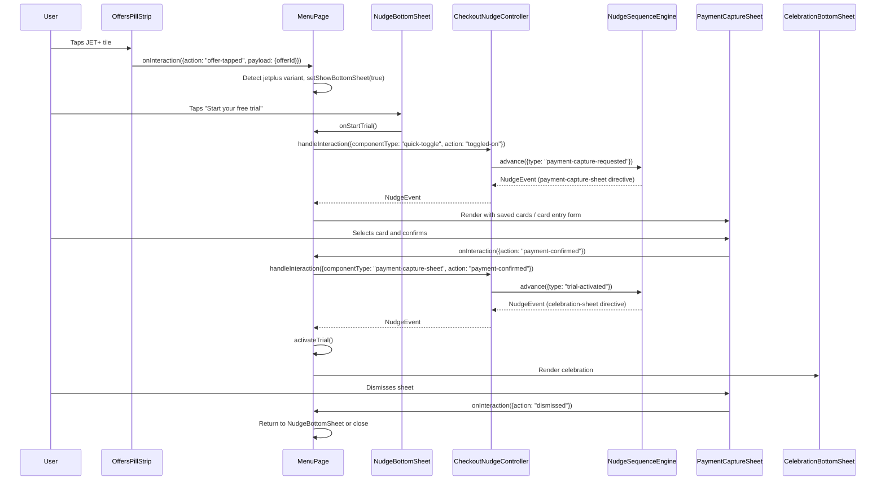

# Design Document: Free Trial Payment Capture

## Overview

This feature inserts a payment capture step into the existing JET+ free trial activation flow. Currently, tapping "Start your free trial" on the `NudgeBottomSheet` immediately activates the trial and shows the `CelebrationBottomSheet`. With this change, the CTA instead opens a new `PaymentCaptureSheet` bottom sheet that collects a saved card selection or new card entry. Only after valid payment details are confirmed does the `trial-activated` trigger fire, advancing the nudge sequence to the celebration step.

Additionally, the JET+ tile tap in `OffersPillStrip` on the menu screen is wired up to trigger the `NudgeBottomSheet` upsell flow, which currently has no handler for JET+ variant `offer-tapped` interactions.

### Technical Approach

1. **New nudge sequence step**: Insert a `payment-capture` step between the existing `upsell-offer` / `trial-offer` step and the `delight-confirm` / `upsell-confirm` step in all four nudge sequences. The new step uses a `payment-capture-requested` trigger (fired when the user taps the trial CTA) and emits a `UIDirective` for `componentType: "payment-capture-sheet"`.

2. **New trigger condition**: Add a `payment-capture-requested` trigger type to the `TriggerCondition` union so the sequence engine can gate the payment capture step.

3. **New PIE component**: `PaymentCaptureSheet` — a React bottom sheet that renders saved cards and a new card entry form. It fires `PIEInteractionEvent` with `componentType: "payment-capture-sheet"` and action `"payment-confirmed"` or `"dismissed"`.

4. **Controller wiring**: `CheckoutNudgeController.mapInteractionToTrigger` maps `quick-toggle toggled-on` → `payment-capture-requested` (instead of directly to `trial-activated`), and maps `payment-capture-sheet payment-confirmed` → `trial-activated`.

5. **OffersPillStrip → NudgeBottomSheet**: In `MenuPage`, handle the `offer-tapped` interaction from JET+ variant offers by opening the `NudgeBottomSheet`.

## Architecture

### Flow Diagram



### Layer Boundaries

The architecture preserves the existing two-layer separation:

- **Conversational Layer** (no React): The new `payment-capture-requested` trigger type and updated sequences live here. The engine knows nothing about cards or payment UI — it only knows that a step requires this trigger to advance.
- **PIE Component Layer** (React): `PaymentCaptureSheet` is a pure PIE component that receives a `UIDirective` with saved card data in `props` and emits interaction events. All payment validation logic lives in this component.
- **Integration Layer** (`MenuPage`, `CheckoutNudgeController`): Wires interactions between layers. The controller maps PIE interaction events to trigger conditions.

## Components and Interfaces

### New Types (`src/types/index.ts`)

```typescript
// Add to TriggerCondition union:
| { type: 'payment-capture-requested' }

// Payment Types
export interface SavedCard {
  id: string;
  brand: 'visa' | 'mastercard' | 'amex';
  lastFour: string;
  expiryMonth: number;  // 1-12
  expiryYear: number;   // 4-digit year
}

export interface CardEntryData {
  cardNumber: string;
  expiryMonth: number;
  expiryYear: number;
  cvv: string;
  cardholderName: string;
}

export type PaymentMethod =
  | { type: 'saved-card'; cardId: string }
  | { type: 'new-card'; card: CardEntryData };
```

### PaymentCaptureSheet Props (via UIDirective)

The `PaymentCaptureSheet` receives its data through the standard `PIEComponentProps` interface. The `UIDirective.props` shape:

```typescript
interface PaymentCaptureSheetDirectiveProps {
  savedCards: SavedCard[];       // User's saved payment cards (may be empty)
  trialDuration: string;         // e.g. "14 days"
  savingsAmount: string;         // e.g. "£3.50"
}
```

### PaymentCaptureSheet Interaction Events

```typescript
// Emitted via onInteraction callback:
{ componentType: 'payment-capture-sheet', action: 'payment-confirmed', payload: { paymentMethod: PaymentMethod } }
{ componentType: 'payment-capture-sheet', action: 'dismissed' }
```

### Updated Controller Mapping

In `CheckoutNudgeController.mapInteractionToTrigger`:

```typescript
// quick-toggle toggled-on now triggers payment capture, not trial activation
if (event.componentType === 'quick-toggle' && event.action === 'toggled-on') {
  return { type: 'payment-capture-requested' };
}

// New: payment confirmed triggers trial activation
if (event.componentType === 'payment-capture-sheet' && event.action === 'payment-confirmed') {
  return { type: 'trial-activated' };
}
```

### Updated Nudge Sequences

Each of the four sequences gains a new step between the offer/toggle step and the confirmation step:

```typescript
// New step inserted before delight-confirm / upsell-confirm:
{
  stepId: 'payment-capture',
  trigger: { type: 'payment-capture-requested' },
  messageTemplate: 'Add your payment details to start your free {{trialDuration}} trial.',
  uiDirective: {
    componentType: 'payment-capture-sheet',
    props: {
      savedCards: [],  // Populated at runtime by controller
      trialDuration: '{{trialDuration}}',
      savingsAmount: '{{currentOrderSavings}}',
    },
  },
}
```

### OffersPillStrip to NudgeBottomSheet Wiring

In `MenuPage`, the existing `handleInteraction` callback is extended:

```typescript
if (event.componentType === 'offers-pill-strip' && event.action === 'offer-tapped') {
  const offerId = event.payload?.offerId as string;
  const offer = offers.find(o => o.id === offerId);
  if (offer?.variant === 'jetplus') {
    setShowBottomSheet(true);
  }
}
```

## Data Models

### State Flow

```
MenuPage state:
  nudgeEvent: NudgeEvent | null        -- current nudge event from engine
  showBottomSheet: boolean             -- NudgeBottomSheet visibility
  showPaymentCapture: boolean (new)    -- PaymentCaptureSheet visibility
```

When `nudgeEvent.uiDirective.componentType === 'payment-capture-sheet'`, `MenuPage` sets `showPaymentCapture = true` and renders `PaymentCaptureSheet`.

### Saved Cards Data Source

Saved cards are provided to the nudge sequence at runtime. The `CheckoutNudgeController` receives saved cards during initialization (new optional parameter) and injects them into the `payment-capture` step's `UIDirective.props.savedCards` when the engine emits that step. This keeps the Conversational Layer pure — it declares the shape, the integration layer fills in the data.

### Card Validation Rules

All validation is client-side within `PaymentCaptureSheet`:

| Field | Rule |
|-------|------|
| Card number | Luhn check, 13-19 digits |
| Expiry | Not in the past (month/year >= current) |
| CVV | 3 digits (4 for Amex) |
| Cardholder name | Non-empty after trimming |

The "Confirm" button is disabled until all validation passes.


## Correctness Properties

*A property is a characteristic or behavior that should hold true across all valid executions of a system — essentially, a formal statement about what the system should do. Properties serve as the bridge between human-readable specifications and machine-verifiable correctness guarantees.*

### Property 1: Controller maps quick-toggle to payment-capture-requested

*For any* `PIEInteractionEvent` with `componentType: "quick-toggle"` and `action: "toggled-on"`, the `CheckoutNudgeController.mapInteractionToTrigger` method SHALL return a trigger of type `payment-capture-requested` (never `trial-activated`).

**Validates: Requirements 1.1**

### Property 2: Payment-confirmed maps to trial-activated

*For any* `PIEInteractionEvent` with `componentType: "payment-capture-sheet"` and `action: "payment-confirmed"`, the `CheckoutNudgeController.mapInteractionToTrigger` method SHALL return a trigger of type `trial-activated`.

**Validates: Requirements 1.5**

### Property 3: Engine trigger matching for payment-capture-requested

*For any* `NudgeStep` whose trigger is `{ type: 'payment-capture-requested' }`, the `NudgeSequenceEngine` SHALL advance when provided a matching `payment-capture-requested` trigger, and SHALL NOT advance for any other trigger type.

**Validates: Requirements 1.8**

### Property 4: Card entry validation composite

*For any* `CardEntryData` object, the composite validation function SHALL return `true` if and only if: (a) the card number passes the Luhn algorithm and has 13-19 digits, (b) the expiry month/year is not in the past, (c) the CVV is all digits with length 3 for visa/mastercard or 4 for amex, and (d) the cardholder name is non-empty after trimming.

**Validates: Requirements 1.4, 1.9, 1.10, 1.11**

### Property 5: Luhn check digit round-trip

*For any* digit string of length 12-18, computing and appending the Luhn check digit SHALL produce a string that passes Luhn validation.

**Validates: Requirements 1.9**

### Property 6: Nudge sequence advances through payment capture to celebration

*For any* nudge sequence containing a `payment-capture` step followed by a celebration step, advancing with `payment-capture-requested` then `trial-activated` SHALL produce events with stepIds `"payment-capture"` then the confirmation stepId, and the final event's `uiDirective.componentType` SHALL be `"celebration-sheet"`.

**Validates: Requirements 1.5**

### Property 7: JET+ offer tap triggers bottom sheet, standard does not

*For any* offer object, an `offer-tapped` interaction SHALL trigger the NudgeBottomSheet if and only if the offer's variant is `"jetplus"`.

**Validates: Requirements 1.7**

## Error Handling

Following the project's existing error handling conventions:

### Conversational Layer (no exceptions to UI)

- **Unknown trigger type**: `NudgeSequenceEngine.triggersMatch` returns `false` for unrecognized trigger types. The `advance` method returns `null`. No exception thrown.
- **No sequence loaded**: All engine methods return `null` or `true` (for `isComplete`) when no sequence is loaded.
- **Missing template variables**: The `resolveTemplate` function leaves `{{placeholder}}` syntax in place for unresolved variables. The UI renders the raw placeholder rather than crashing.

### PIE Component Layer (best-effort rendering)

- **Empty saved cards array**: `PaymentCaptureSheet` renders only the new card entry form. No error state.
- **Invalid directive props**: If `savedCards` is missing or not an array, default to empty array. If `trialDuration` or `savingsAmount` are missing, render with fallback text.
- **Card validation failures**: Inline validation messages appear below each field. The confirm button remains disabled. No error events emitted — the user simply cannot proceed until validation passes.
- **Unknown componentType**: `PIERenderer` logs a warning and returns `null` per existing convention.

### Integration Layer (MenuPage / Controller)

- **Payment capture dismissed**: The `dismissed` interaction returns the user to the NudgeBottomSheet state. The nudge sequence does NOT advance — the engine stays on the `payment-capture` step, allowing the user to retry.
- **Controller not initialized**: `handleInteraction` returns `null` when the engine is null. The UI ignores null events.
- **Offer tap with missing offer data**: If the offer ID from the `offer-tapped` event doesn't match any known offer, no action is taken (no bottom sheet opened).

## Testing Strategy

### Property-Based Tests (fast-check, minimum 100 iterations each)

Property-based tests validate the correctness properties defined above. Use `fast-check` as the PBT library with Vitest.

| Property | Test File | What It Generates |
|----------|-----------|-------------------|
| P1: Controller maps quick-toggle to payment-capture-requested | `src/checkout/CheckoutNudgeController.test.ts` | Random PIEInteractionEvent objects with componentType "quick-toggle" |
| P2: Payment-confirmed maps to trial-activated | `src/checkout/CheckoutNudgeController.test.ts` | Random PIEInteractionEvent objects with componentType "payment-capture-sheet" |
| P3: Engine trigger matching for payment-capture-requested | `src/conversational/NudgeSequenceEngine.test.ts` | Random TriggerCondition objects |
| P4: Card entry validation composite | `src/pie/PaymentCaptureSheet.test.ts` | Random CardEntryData with valid/invalid combinations |
| P5: Luhn check digit round-trip | `src/pie/PaymentCaptureSheet.test.ts` | Random digit strings of length 12-18 |
| P6: Sequence advances through payment capture | `src/conversational/NudgeSequenceEngine.test.ts` | Sequences with payment-capture + celebration steps |
| P7: JET+ offer tap triggers bottom sheet | `src/menu/MenuPage.test.ts` | Random offer objects with variant "jetplus" or "standard" |

Each property test must be tagged:
```
// Feature: free-trial-payment-capture, Property {N}: {title}
```

### Unit Tests (example-based)

- **PaymentCaptureSheet rendering**: Saved cards list renders correct count; new card form is always present; confirm button disabled when no selection/invalid entry.
- **PaymentCaptureSheet dismissal**: Dismissed interaction event emitted on backdrop tap, close button, and Escape key.
- **Sequence integration**: Full 4-step sequence (alert -> offer -> payment-capture -> celebration) advances correctly with the right triggers in order.
- **MenuPage wiring**: JET+ tile tap opens NudgeBottomSheet; payment-confirmed closes PaymentCaptureSheet and shows CelebrationBottomSheet; dismissed returns to NudgeBottomSheet.
- **Accessibility**: Focus trap within PaymentCaptureSheet; Escape key dismisses; ARIA labels on form fields; focus returns to trigger element on dismiss.

### Integration Tests

- **End-to-end flow**: OffersPillStrip JET+ tap -> NudgeBottomSheet -> "Start your free trial" -> PaymentCaptureSheet -> select saved card -> confirm -> CelebrationBottomSheet appears -> trial is active.
- **Abandonment flow**: User opens PaymentCaptureSheet, dismisses it, NudgeBottomSheet is still available, sequence has not advanced.
