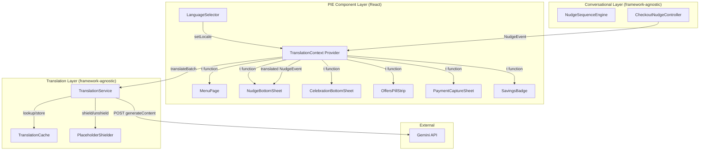
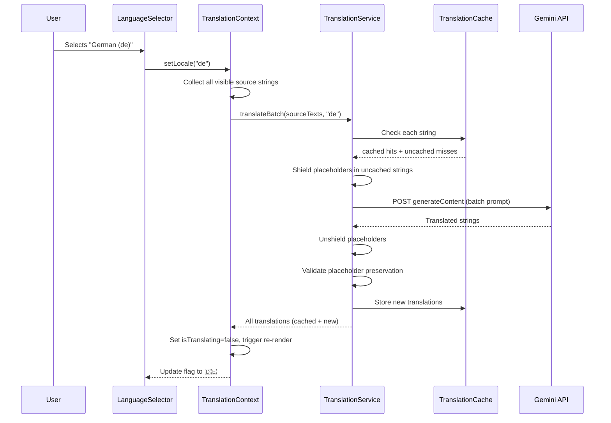

# Design Document: Gemini Translation Layer

## Overview

The Gemini Translation Layer adds real-time, AI-powered translation to the food delivery checkout app. It follows the existing two-layer architecture: a framework-agnostic Translation Service (`src/translation/`) handles Gemini API communication, caching, and placeholder preservation, while a React TranslationContext provider and LanguageSelector PIE component handle UI integration.

The translation flow:
1. User selects a language via the LanguageSelector dropdown in the top bar
2. TranslationContext updates the active locale and collects all visible strings
3. Translation Service batches uncached strings into a single Gemini API call
4. Translated strings are cached and served via the `t()` function
5. All PIE components re-render with translated text; NudgeEvent messages are translated before reaching the PIE layer

Key design decisions:
- **Batch-first API strategy**: Multiple strings are grouped into one Gemini `generateContent` call to minimise network overhead and API costs
- **Placeholder shielding**: `{{key}}` tokens and currency values are replaced with numbered XML tags before sending to Gemini, then restored after — this prevents the LLM from translating or mangling dynamic content
- **Graceful degradation**: All API failures fall back to English source text; the app never breaks due to translation errors
- **Cache-per-session**: An in-memory map keyed by `(locale, sourceText)` avoids redundant API calls when switching between previously used languages

## Architecture



The Translation Layer (`src/translation/`) sits alongside the Conversational Layer as a peer module with zero React dependencies. The TranslationContext bridges it into the React tree.

### Data Flow for Language Switch



## Components and Interfaces

### 1. TranslationService (`src/translation/TranslationService.ts`)

Framework-agnostic module. No React imports.

```typescript
/** Supported locale codes */
type Locale = 'en' | 'de' | 'es' | 'fr' | 'nl';

/** Input contract for batch translation */
interface TranslationRequest {
  sourceTexts: string[];
  targetLocale: string;
}

/** Output contract for batch translation */
interface TranslationResponse {
  translations: string[];
}

interface TranslationServiceConfig {
  apiKey: string;
  timeoutMs?: number;       // default: 10000
  modelName?: string;       // default: 'gemini-2.0-flash'
}

class TranslationService {
  constructor(config: TranslationServiceConfig);

  /**
   * Translates a batch of source texts to the target locale.
   * - Checks cache first; only sends uncached strings to Gemini
   * - Shields placeholders and currency values before API call
   * - Validates placeholder preservation on response
   * - Falls back to source text on any failure
   * Returns: translations[] positionally matching sourceTexts[]
   */
  translateBatch(request: TranslationRequest): Promise<TranslationResponse>;

  /** Clear all cached translations (useful for testing) */
  clearCache(): void;
}
```

### 2. TranslationCache (`src/translation/TranslationCache.ts`)

```typescript
class TranslationCache {
  /** Store a translation. Key: (locale, sourceText) */
  set(locale: string, sourceText: string, translation: string): void;

  /** Retrieve a cached translation, or undefined if not cached */
  get(locale: string, sourceText: string): string | undefined;

  /** Check if a translation exists in cache */
  has(locale: string, sourceText: string): boolean;

  /** Clear all entries */
  clear(): void;
}
```

Implementation: a `Map<string, string>` keyed by `${locale}::${sourceText}`.

### 3. PlaceholderShielder (`src/translation/PlaceholderShielder.ts`)

```typescript
interface ShieldResult {
  shieldedText: string;
  tokens: Map<string, string>;  // e.g. "<x1>" → "{{fee}}", "<x2>" → "£3.99"
}

/** Replace {{key}} tokens and currency values with XML shield tags */
function shield(sourceText: string): ShieldResult;

/** Restore original tokens from XML shield tags */
function unshield(translatedText: string, tokens: Map<string, string>): string;

/** Extract all {{key}} placeholder tokens from a string */
function extractPlaceholders(text: string): string[];

/** Validate that translated text contains all original placeholders */
function validatePlaceholders(sourceText: string, translatedText: string): boolean;
```

The shielding strategy:
1. Find all `{{key}}` tokens and currency patterns (`£X.XX`, `€X.XX`, etc.)
2. Replace each with a numbered XML tag: `<x1>`, `<x2>`, etc.
3. Include instruction in the Gemini prompt: "Preserve all `<xN>` tags exactly as-is"
4. After translation, replace `<xN>` tags back with original values
5. Validate that all original `{{key}}` tokens are present in the final output

### 4. TranslationContext (`src/translation/TranslationContext.tsx`)

React context provider — the only React file in the translation feature.

```typescript
interface TranslationContextValue {
  locale: Locale;
  setLocale: (locale: Locale) => void;
  t: (sourceText: string) => string;
  isTranslating: boolean;
}

/** Provider wraps the app at the root level */
function TranslationProvider(props: {
  children: React.ReactNode;
  service?: TranslationService;  // injectable for testing
}): JSX.Element;

/** Hook for consuming components */
function useTranslation(): TranslationContextValue;
```

Behaviour:
- Initialises with locale `"en"`
- When locale is `"en"`, `t()` returns source text unchanged (no API call)
- When locale changes, collects all registered source strings, calls `translateBatch` for uncached ones
- While batch is in-flight, `isTranslating` is `true` and `t()` returns source text as fallback
- Once batch completes, triggers re-render with translated strings

### 5. LanguageSelector (`src/pie/LanguageSelector.tsx`)

PIE component rendered in the MenuPage top bar.

```typescript
interface LanguageSelectorProps {
  locale: Locale;
  isTranslating: boolean;
  onLocaleChange: (locale: Locale) => void;
}
```

Visual spec:
- 24×24px country flag icon button, positioned left of the search button in the top bar
- Dropdown: PIE elevation token `--dt-elevation-below-20`, radius `--dt-radius-rounded-c`, padding `--dt-spacing-c`
- Each row: flag (20×20px) + language name in Takeaway Sans Regular 400, 14px
- Active locale row highlighted with `--dt-color-background-subtle`
- Loading state: semi-transparent spinner overlay on the flag icon when `isTranslating` is true

Supported languages with flag emoji:
| Locale | Flag | Name |
|--------|------|------|
| `en` | 🇬🇧 | English |
| `de` | 🇩🇪 | German |
| `es` | 🇪🇸 | Spanish |
| `fr` | 🇫🇷 | French |
| `nl` | 🇳🇱 | Dutch |

Accessibility:
- `aria-haspopup="listbox"` on the trigger button
- `aria-expanded="true|false"` toggled with dropdown state
- `aria-label="Select language"` on the trigger
- `role="listbox"` on the dropdown, `role="option"` on each item
- `aria-live="polite"` region announces locale changes
- Keyboard: Arrow Up/Down to navigate, Enter to select, Escape to close
- `prefers-reduced-motion: reduce` suppresses open/close animations
- Flag images include `alt` text with language name (e.g., `alt="English"`)

### 6. NudgeEvent Translation Integration

NudgeEvents are translated at the boundary between the Conversational Layer and the PIE Component Layer. The TranslationContext intercepts the `message` field and any string props in `uiDirective.props` before they reach the renderer.

In MenuPage (and CheckoutPage), when a NudgeEvent is received:

```typescript
// Before passing to PIE components:
const translatedMessage = t(nudgeEvent.message);
const translatedProps = translateDirectiveProps(nudgeEvent.uiDirective.props, t);
```

This keeps the Conversational Layer completely unaware of translation — it continues to emit English NudgeEvents. Translation is applied at the integration boundary.

## Data Models

### Locale Type

```typescript
type Locale = 'en' | 'de' | 'es' | 'fr' | 'nl';
```

Added to `src/types/index.ts`.

### TranslationRequest / TranslationResponse

```typescript
interface TranslationRequest {
  sourceTexts: string[];
  targetLocale: string;
}

interface TranslationResponse {
  translations: string[];
}
```

These are the serialisation contracts for the TranslationService. They are framework-agnostic plain JSON objects.

### TranslationCache Internal Structure

```
Map<string, string>
Key format: "${locale}::${sourceText}"
Value: translated string
```

### Gemini API Prompt Structure

The TranslationService constructs a prompt for the Gemini `generateContent` endpoint:

```
POST https://generativelanguage.googleapis.com/v1beta/models/gemini-2.0-flash:generateContent

{
  "contents": [{
    "parts": [{
      "text": "Translate the following UI strings from English to {targetLocale}. Return ONLY a JSON array of translated strings in the same order. Preserve all <xN> tags exactly as they appear.\n\n[\"shielded string 1\", \"shielded string 2\", ...]"
    }]
  }],
  "generationConfig": {
    "temperature": 0.1,
    "responseMimeType": "application/json"
  }
}
```

Low temperature (0.1) ensures consistent, deterministic translations. The `responseMimeType: "application/json"` forces structured JSON output from Gemini.

## Correctness Properties

*A property is a characteristic or behavior that should hold true across all valid executions of a system — essentially, a formal statement about what the system should do. Properties serve as the bridge between human-readable specifications and machine-verifiable correctness guarantees.*

### Property 1: English locale identity

*For any* source text string, when the active locale is `"en"`, calling `t(sourceText)` SHALL return the exact same string unchanged.

**Validates: Requirements 2.3**

### Property 2: Cache round-trip

*For any* locale, source text, and translation string, storing a translation in the TranslationCache and then retrieving it with the same (locale, sourceText) key SHALL return the identical translation string.

**Validates: Requirements 7.4, 2.4, 7.2**

### Property 3: Batch grouping

*For any* array of untranslated source texts and a target locale, the TranslationService SHALL send exactly one Gemini API call containing all the untranslated strings, rather than individual calls per string.

**Validates: Requirements 3.3**

### Property 4: API failure graceful fallback

*For any* source text and target locale, if the Gemini API request fails or times out, the TranslationService SHALL return the original source text unchanged and log a structured warning.

**Validates: Requirements 3.4**

### Property 5: Placeholder and currency token preservation

*For any* source text containing `{{key}}` placeholder tokens and/or currency values, translating from English to any supported locale SHALL produce output containing the exact same set of placeholder tokens and currency values as the source text.

**Validates: Requirements 4.1, 4.2, 4.3**

### Property 6: Missing token validation fallback

*For any* source text containing placeholder tokens, if the Gemini API returns a translation that is missing one or more of those tokens, the TranslationService SHALL discard the translation, return the original source text, and log a warning identifying the missing tokens.

**Validates: Requirements 4.4**

### Property 7: NudgeEvent message translation

*For any* NudgeEvent emitted by the Conversational Layer, when the active locale is not `"en"`, the `message` field SHALL be passed through the `t()` function before the PIE Component Layer renders it, and the rendered message SHALL be the translated version.

**Validates: Requirements 5.7**

### Property 8: Pending translation returns source text

*For any* source text where a translation request is in-flight (not yet resolved), calling `t(sourceText)` SHALL return the original source text as a fallback.

**Validates: Requirements 6.4**

### Property 9: Partial cache efficiency

*For any* set of source texts where some are already cached for the target locale, the TranslationService SHALL send a Gemini API request containing only the uncached strings, and the final result SHALL include both cached and newly translated strings in the correct positional order.

**Validates: Requirements 7.3**

### Property 10: Serialisation round-trip with length preservation

*For any* valid TranslationRequest (an array of source text strings and a target locale), serialising the request to JSON, sending it to the TranslationService, and deserialising the response SHALL produce a TranslationResponse where `translations.length` equals `sourceTexts.length` and each translation corresponds positionally to its source text.

**Validates: Requirements 9.1, 9.2, 9.3, 9.4**

### Property 11: Successful translation populates cache

*For any* source text and target locale, when the Gemini API returns a successful and valid translation, the TranslationService SHALL store it in the TranslationCache such that subsequent calls for the same (locale, sourceText) return the cached value without an API call.

**Validates: Requirements 3.2**

## Error Handling

| Scenario | Behaviour | User Impact |
|----------|-----------|-------------|
| Gemini API timeout (>10s) | AbortController cancels request; return source text; log warning with locale + source text | User sees English text for that string |
| Gemini API HTTP error (4xx/5xx) | Return source text for all strings in batch; log error with status code | User sees English text; can retry by re-selecting locale |
| Gemini returns malformed JSON | JSON.parse fails; return source text for entire batch; log warning | User sees English text |
| Gemini returns wrong array length | Discard entire batch; return source texts; log warning with expected vs actual length | User sees English text |
| Translation missing placeholders | Discard that single translation; return source text for that string; log missing tokens | User sees English for that string; other translations in batch are unaffected |
| `VITE_GEMINI_API_KEY` not set | TranslationService logs error on construction; all `translateBatch` calls return source texts | App works fully in English; no crashes |
| Network offline | fetch rejects; same as API timeout handling | User sees English text |
| Dropdown click-outside during translation | Dropdown closes; translation continues in background | No interruption to translation |

All error paths follow the Conversational Layer convention: never throw to the UI layer. Errors result in graceful fallback to English source text with structured console warnings.

## Testing Strategy

### Property-Based Tests (fast-check, minimum 100 iterations each)

Each property from the Correctness Properties section maps to one property-based test:

| Test | Property | Module Under Test |
|------|----------|-------------------|
| English locale identity | Property 1 | TranslationContext |
| Cache round-trip | Property 2 | TranslationCache |
| Batch grouping | Property 3 | TranslationService |
| API failure fallback | Property 4 | TranslationService |
| Placeholder/currency preservation | Property 5 | PlaceholderShielder |
| Missing token fallback | Property 6 | TranslationService |
| NudgeEvent translation | Property 7 | TranslationContext + MenuPage integration |
| Pending returns source text | Property 8 | TranslationContext |
| Partial cache efficiency | Property 9 | TranslationService |
| Serialisation round-trip | Property 10 | TranslationService |
| Successful translation populates cache | Property 11 | TranslationService |

Tag format: `// Feature: gemini-translation-layer, Property {N}: {title}`

Library: `fast-check` (already in devDependencies)

### Unit Tests (Vitest)

- LanguageSelector: renders flag, opens/closes dropdown, keyboard navigation, ARIA attributes, click-outside dismissal, loading spinner, reduced-motion
- TranslationContext: initialises with "en", setLocale triggers re-render, t() returns source text for "en"
- TranslationService: API key from env var, 10s timeout configuration, prompt construction
- PlaceholderShielder: shield/unshield specific examples (e.g., `"Save {{fee}} on delivery"` → shielded → unshielded round-trip)

### Integration Tests

- MenuPage with TranslationProvider: change locale, verify all text elements update
- NudgeEvent flow: emit event → translate → render in NudgeBottomSheet
- OffersPillStrip, CelebrationBottomSheet, PaymentCaptureSheet, SavingsBadge: each with locale change verification

### Mocking Strategy

- Gemini API calls are mocked in all unit and property tests using `vi.fn()` or `vi.spyOn(globalThis, 'fetch')`
- TranslationService is injectable into TranslationContext for test isolation
- No real Gemini API calls in CI — all tests use deterministic mock responses
