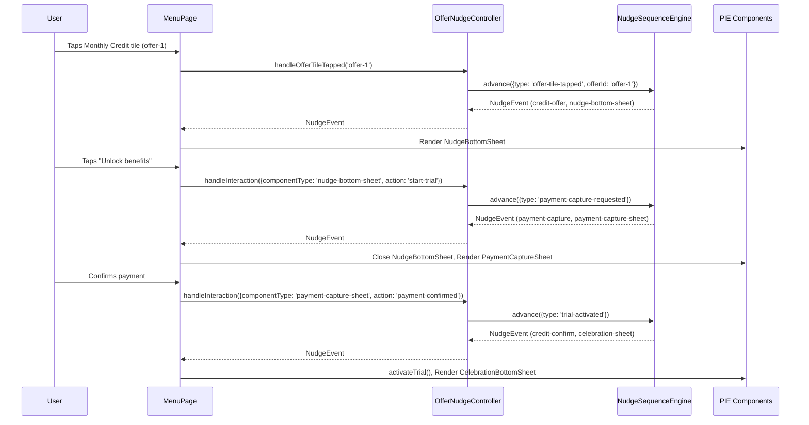
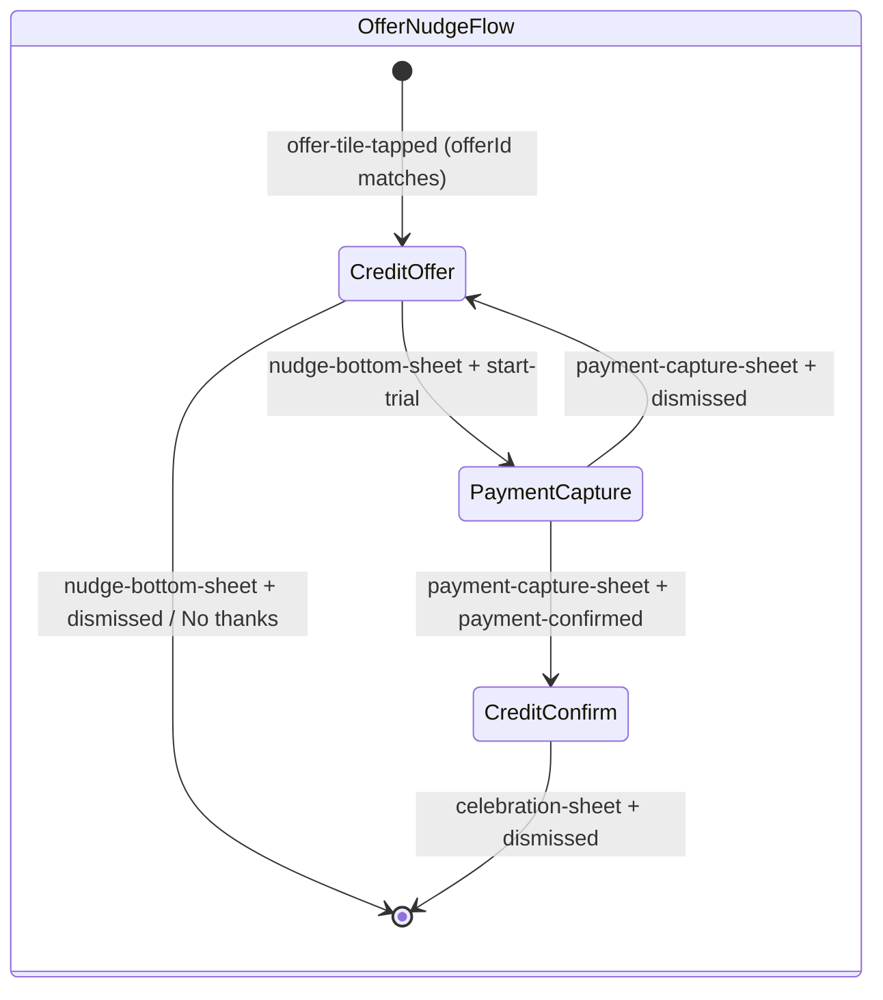

# Design Document: Monthly Credit Nudge Layer

## Overview

This feature adds a new nudge sequence and controller for the "£10 monthly credit" offer tile in the OffersPillStrip. When a user taps the JET+ monthly credit tile (`offer-1`), a 3-step conversational nudge flow activates:

1. **credit-offer** — NudgeBottomSheet presenting the monthly credit benefit with archetype-aware messaging
2. **payment-capture** — PaymentCaptureSheet for payment method selection
3. **credit-confirm** — CelebrationBottomSheet with peak-end-rule confetti celebration

The flow is driven by a new `OfferNudgeController` (analogous to `CheckoutNudgeController`) that orchestrates the sequence via the existing `NudgeSequenceEngine`. A new `offer-tile-tapped` trigger condition type is added to the `TriggerCondition` union to distinguish offer-driven nudges from checkout-driven ones.

Key design decisions:
- The monthly credit flow operates **independently** from the checkout nudge flow — each controller maintains its own `NudgeSequenceEngine` instance with distinct stepIds.
- No MOV gate is required — the offer tile tap is not gated by basket total.
- Two archetype-specific sequence variants are defined: `squeezedSaverMonthlyCreditSequence` (loss-aversion framing) and `valueSeekerMonthlyCreditSequence` (identity-reinforcement framing), following the same pattern as `CHECKOUT_SEQUENCES` in `CheckoutNudgeController`.
- All existing PIE components (NudgeBottomSheet, PaymentCaptureSheet, CelebrationBottomSheet) are reused without modification.

## Architecture





### File Structure

New files:
- `src/conversational/sequences/squeezedSaverMonthlyCredit.ts` — Squeezed Saver monthly credit sequence
- `src/conversational/sequences/valueSeekerMonthlyCredit.ts` — Value Seeker monthly credit sequence
- `src/checkout/OfferNudgeController.ts` — Controller orchestrating the offer nudge flow
- `src/checkout/OfferNudgeController.test.ts` — Unit + property tests for the controller

Modified files:
- `src/types/index.ts` — Add `offer-tile-tapped` to `TriggerCondition` union
- `src/conversational/NudgeSequenceEngine.ts` — Add `offer-tile-tapped` trigger matching in `triggersMatch()`
- `src/menu/MenuPage.tsx` — Integrate `OfferNudgeController` alongside existing `CheckoutNudgeController`
- `src/App.tsx` — Instantiate and pass `OfferNudgeController` to `MenuPage`

## Components and Interfaces

### New: `OfferNudgeController`

Location: `src/checkout/OfferNudgeController.ts`

```typescript
import { NudgeEvent, NudgeSequence, PIEInteractionEvent, BehavioralStrategyName } from '../types/index';
import { UserContextEvaluator } from '../conversational/UserContextEvaluator';
import { StrategySelector } from '../conversational/StrategySelector';
import { ArchetypeRegistry } from '../conversational/ArchetypeRegistry';
import { NudgeSequenceEngine } from '../conversational/NudgeSequenceEngine';

export interface OfferInitResult {
  archetypeName: string;
  strategyName: BehavioralStrategyName;
}

export class OfferNudgeController {
  private readonly evaluator: UserContextEvaluator;
  private readonly selector: StrategySelector;
  private engine: NudgeSequenceEngine | null = null;

  constructor(
    evaluator: UserContextEvaluator,
    selector: StrategySelector,
    registry: ArchetypeRegistry,
  );

  /** Evaluate user context, select strategy, load monthly credit sequence. Returns null if no archetype. */
  initialize(userId: string): OfferInitResult | null;

  /** Advance the sequence with an offer-tile-tapped trigger. */
  handleOfferTileTapped(offerId: string): NudgeEvent | null;

  /** Map a PIE interaction to a trigger and advance the sequence. */
  handleInteraction(event: PIEInteractionEvent): NudgeEvent | null;

  /** Reset the sequence to step 0. */
  reset(): void;
}
```

Interaction-to-trigger mappings:
| PIE Interaction | Trigger Condition |
|---|---|
| `nudge-bottom-sheet` + `start-trial` | `{ type: 'payment-capture-requested' }` |
| `payment-capture-sheet` + `payment-confirmed` | `{ type: 'trial-activated' }` |
| `payment-capture-sheet` + `dismissed` | `null` (no advance, stay on payment-capture) |
| `celebration-sheet` + `dismissed` | `null` (sequence complete) |

Key differences from `CheckoutNudgeController`:
- No MOV gate — offer tile tap is not gated by basket total (Req 11.4)
- No `handleItemAdded()` / `handleCheckout()` / `triggerFirstStep()` — entry point is `handleOfferTileTapped()`
- Uses `MONTHLY_CREDIT_SEQUENCES` map instead of `CHECKOUT_SEQUENCES` / `UPSELL_SEQUENCES`
- Template context includes `creditAmount` (£10.00) and `trialDuration` (30-day)

### Modified: `TriggerCondition` union

```typescript
// Add to existing union in src/types/index.ts
export type TriggerCondition =
  | { type: 'item-added-to-basket'; feeGreaterThan: number }
  | { type: 'checkout-reached'; feeGreaterThan: number }
  | { type: 'nudge-tapped'; stepId: string }
  | { type: 'trial-activated' }
  | { type: 'payment-capture-requested' }
  | { type: 'subscription-upsell'; monthlyFeesExceed: number }
  | { type: 'offer-tile-tapped'; offerId: string };  // NEW
```

### Modified: `NudgeSequenceEngine.triggersMatch()`

Add a new case for `offer-tile-tapped`:

```typescript
case 'offer-tile-tapped': {
  const p = provided as { type: 'offer-tile-tapped'; offerId: string };
  return p.offerId === stepTrigger.offerId;
}
```

### New: Monthly Credit Sequences

Two archetype-specific sequence files following the existing pattern:

**`squeezedSaverMonthlyCreditSequence`** (`src/conversational/sequences/squeezedSaverMonthlyCredit.ts`):
- Step 1 `credit-offer`: trigger `offer-tile-tapped` with `offerId: 'offer-1'`, componentType `nudge-bottom-sheet`, loss-aversion messaging
- Step 2 `payment-capture`: trigger `payment-capture-requested`, componentType `payment-capture-sheet`
- Step 3 `credit-confirm`: trigger `trial-activated`, componentType `celebration-sheet`, `strategyOverride: 'peak-end-rule'`

**`valueSeekerMonthlyCreditSequence`** (`src/conversational/sequences/valueSeekerMonthlyCredit.ts`):
- Same 3-step structure with identity-reinforcement messaging

### Modified: `MenuPage`

The MenuPage will accept an additional `offerController` prop of type `OfferNudgeController`. The existing `handleInteraction` callback will be extended to route offer-related interactions to the `OfferNudgeController` while checkout interactions continue to use the `CheckoutNudgeController`.

Key state additions:
- `offerNudgeEvent: NudgeEvent | null` — tracks the current offer nudge event separately from the checkout nudge event
- `showOfferBottomSheet: boolean` — controls NudgeBottomSheet visibility for the offer flow
- `showOfferPaymentCapture: boolean` — controls PaymentCaptureSheet visibility for the offer flow

The offer flow state is independent from the checkout flow state, ensuring both can operate without interference (Req 11.1, 11.2).

### Modified: `App.tsx`

Instantiate `OfferNudgeController` alongside `CheckoutNudgeController` using the same `UserContextEvaluator`, `StrategySelector`, and `ArchetypeRegistry` instances. Pass it to `MenuPage` as the `offerController` prop.

## Data Models

### New TriggerCondition variant

```typescript
{ type: 'offer-tile-tapped'; offerId: string }
```

The `offerId` field matches against the offer's `id` in the `OFFERS` array (e.g., `'offer-1'` for the JET+ monthly credit tile).

### Monthly Credit Sequence Structure

Each monthly credit sequence follows the existing `NudgeSequence` interface with 3 steps:

| Step | stepId | Trigger | componentType | strategyOverride |
|------|--------|---------|---------------|------------------|
| 1 | `credit-offer` | `offer-tile-tapped` (offerId: `offer-1`) | `nudge-bottom-sheet` | — |
| 2 | `payment-capture` | `payment-capture-requested` | `payment-capture-sheet` | — |
| 3 | `credit-confirm` | `trial-activated` | `celebration-sheet` | `peak-end-rule` |

### Template Context

The `OfferNudgeController` populates the template context with:

| Key | Value | Source |
|-----|-------|--------|
| `creditAmount` | `£10.00` | Hardcoded (1000 pence) |
| `trialDuration` | `30-day` | Configuration |
| `userName` | `Sam` or `Alex` | Archetype persona mapping |

### NudgeEvent Props for `nudge-bottom-sheet`

The `credit-offer` step's UIDirective props will include:

```typescript
{
  componentType: 'nudge-bottom-sheet',
  props: {
    creditValuePence: 1000,
    benefits: [
      { title: '£10 credit', subtitle: 'use up to £5 credit daily.' },
      { title: 'Exclusive offers', subtitle: 'from best-loved brands.' },
      { title: '5 free deliveries', subtitle: 'Refreshes each month' },
    ],
    faqItems: [
      { question: 'What payment methods can I use?', answer: '...' },
      { question: 'Where can I use my credit?', answer: '...' },
      { question: 'Can I cancel my Just Eat+ membership?', answer: '...' },
    ],
  },
}
```


## Correctness Properties

*A property is a characteristic or behavior that should hold true across all valid executions of a system — essentially, a formal statement about what the system should do. Properties serve as the bridge between human-readable specifications and machine-verifiable correctness guarantees.*

### Property 1: Offer-tile-tapped trigger matching

*For any* offerId string, when the NudgeSequenceEngine has a step with an `offer-tile-tapped` trigger, advancing with a matching offerId SHALL emit a NudgeEvent, and advancing with any non-matching offerId SHALL return null and leave the engine on the same step.

**Validates: Requirements 2.2, 2.3**

### Property 2: Controller initialization selects correct sequence and context

*For any* known archetype name (`squeezed-saver` or `value-seeker`), when `OfferNudgeController.initialize(userId)` is called, the controller SHALL return an `OfferInitResult` with the correct `archetypeName` and `strategyName`, load the archetype-specific monthly credit sequence, and populate the template context with `creditAmount` as `£10.00`, `trialDuration` as `30-day`, and `userName` as the archetype's persona name. For a user with no archetype, initialize SHALL return null.

**Validates: Requirements 3.3, 3.4, 3.10, 7.3**

### Property 3: Full offer flow advancement

*For any* initialized OfferNudgeController, the sequence of calls `handleOfferTileTapped('offer-1')` → `handleInteraction({componentType: 'nudge-bottom-sheet', action: 'start-trial'})` → `handleInteraction({componentType: 'payment-capture-sheet', action: 'payment-confirmed'})` SHALL produce NudgeEvents with stepIds `credit-offer`, `payment-capture`, and `credit-confirm` respectively, with componentTypes `nudge-bottom-sheet`, `payment-capture-sheet`, and `celebration-sheet`.

**Validates: Requirements 3.5, 3.6, 3.7, 3.8, 5.2, 6.2**

### Property 4: Template resolution completeness

*For any* valid template context (with `creditAmount`, `trialDuration`, and `userName` keys), all message templates in the monthly credit nudge sequence SHALL resolve to strings containing no `{{...}}` placeholder tokens after template resolution.

**Validates: Requirements 1.9, 8.1, 8.2, 8.3**

### Property 5: NudgeEvent serialization round-trip

*For any* NudgeEvent emitted by the monthly credit nudge sequence, serializing to JSON via `JSON.stringify` then deserializing via `JSON.parse` SHALL produce an object deeply equal to the original event (containing stepId, message, uiDirective, ISO 8601 timestamp, and metadata with archetypeName and strategyName).

**Validates: Requirements 9.1, 9.2, 9.3**

### Property 6: Reset restores initial state

*For any* OfferNudgeController that has been initialized and advanced to any step in the sequence, calling `reset()` SHALL return the engine to step 0 (`credit-offer`), allowing the sequence to be replayed from the beginning.

**Validates: Requirements 3.9**

## Error Handling

| Scenario | Behaviour |
|----------|-----------|
| `initialize()` called for user with no archetype | Returns `null`. No engine created. Subsequent `handleOfferTileTapped()` calls return `null`. |
| `initialize()` called for user with no strategy | Returns `null`. Same as above. |
| `handleOfferTileTapped()` called before `initialize()` | Returns `null` (no engine loaded). |
| `handleOfferTileTapped()` called with non-matching offerId | Returns `null`. Engine stays on current step. |
| `handleInteraction()` called with unrecognized componentType/action | Returns `null`. Engine stays on current step. |
| `handleInteraction()` with `payment-capture-sheet` + `dismissed` | Returns `null`. Engine stays on `payment-capture` step. MenuPage returns to NudgeBottomSheet. |
| PIERenderer receives unknown componentType | Returns `null` and logs warning (existing behavior). |
| Template contains unresolved placeholder | Replaced with empty string, warning logged (existing templateResolver behavior). |
| `reset()` called when no engine loaded | No-op. |

The OfferNudgeController follows the project convention: the Conversational Layer never throws exceptions to the UI layer. All error paths return `null`.

## Testing Strategy

### Property-Based Tests (fast-check, minimum 100 iterations each)

1. **Property 1** — Offer-tile-tapped trigger matching: Generate random offerId strings. Load a sequence with `offer-tile-tapped` trigger. Verify matching offerIds advance the engine and non-matching offerIds return null.
   - Tag: `// Feature: monthly-credit-nudge-layer, Property 1: Offer-tile-tapped trigger matching`

2. **Property 2** — Controller initialization: Generate random archetype selections from `['squeezed-saver', 'value-seeker']` and null-archetype users. Verify correct sequence loading, template context, and null returns.
   - Tag: `// Feature: monthly-credit-nudge-layer, Property 2: Controller initialization selects correct sequence and context`

3. **Property 3** — Full flow advancement: Initialize with random archetypes, run the full 3-step flow, verify each step produces the correct stepId and componentType.
   - Tag: `// Feature: monthly-credit-nudge-layer, Property 3: Full offer flow advancement`

4. **Property 4** — Template resolution completeness: Generate random strings for creditAmount, trialDuration, userName. Load sequences, advance through all steps, verify no `{{...}}` tokens remain.
   - Tag: `// Feature: monthly-credit-nudge-layer, Property 4: Template resolution completeness`

5. **Property 5** — NudgeEvent serialization round-trip: Advance through all steps with random template contexts, verify `JSON.parse(JSON.stringify(event))` deep-equals the original.
   - Tag: `// Feature: monthly-credit-nudge-layer, Property 5: NudgeEvent serialization round-trip`

6. **Property 6** — Reset restores initial state: Initialize and advance to a random step (1, 2, or 3), call reset, verify engine is back at step 0.
   - Tag: `// Feature: monthly-credit-nudge-layer, Property 6: Reset restores initial state`

### Unit / Integration Tests (Vitest)

Example-based tests for specific scenarios and UI integration:

- **Req 1.2–1.8**: Verify sequence structure — 3 steps, correct stepIds, trigger types, componentTypes.
- **Req 4.1–4.4**: MenuPage integration — offer tile tap routes to OfferNudgeController, NudgeBottomSheet renders, dismiss resets controller.
- **Req 5.1–5.3**: NudgeBottomSheet → PaymentCaptureSheet transition on "Unlock benefits" tap.
- **Req 6.1–6.4**: PaymentCaptureSheet → CelebrationBottomSheet transition on payment confirmation; dismiss returns to NudgeBottomSheet.
- **Req 7.1–7.2**: Verify squeezed-saver uses loss-aversion framing, value-seeker uses identity-reinforcement framing in message templates.
- **Req 10.1–10.4**: Error handling — null archetype, non-matching triggers, unknown componentTypes.
- **Req 11.1–11.4**: Independence — both controllers operate simultaneously without interference; distinct stepIds; no MOV gate on offer flow.

### Test Library

- **Runner**: Vitest
- **PBT**: fast-check (already in devDependencies)
- **Component testing**: @testing-library/react (already in devDependencies)
