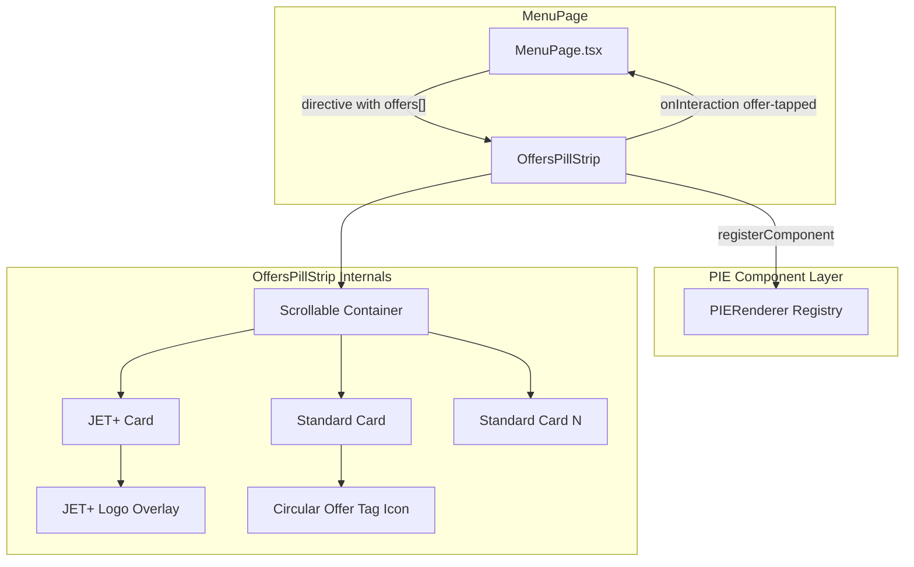

# Design Document: Offers Pill Strip

## Overview

The `OffersPillStrip` is a PIE component that renders a horizontally scrollable strip of offer banner cards, matching the Figma Partner-Offers design (node 8267:109063). It replaces the earlier pill/chip design with card-based banners featuring two variants:

- **jetplus**: Gradient background, orange border, JET+ logo overlay, elevation shadow
- **standard**: Yellow tonal background, circular offer tag icon

The component follows the PIE component pattern: it accepts `PIEComponentProps`, is driven by a `UIDirective`, and is registerable with `PIE_Renderer`. It lives at `src/pie/OffersPillStrip.tsx`. In `MenuPage`, it is rendered directly (not via `pieRender`) to ensure it is always visible on mount.

### Technology Choices

- **Language**: TypeScript (strict mode)
- **UI Framework**: React (PIE component)
- **Testing**: Vitest
- **Design System**: PIE foundations (JET Sans Digital, 4px spacing grid, PIE colour tokens, elevation tokens)

### Key Design Decisions

| Decision | Rationale |
|---|---|
| Single `OffersPillStrip` component | Self-contained like other PIE components (SavingsBadge, QuickToggle). Card variants are internal rendering details. |
| Inline `<style>` tag pattern | Matches existing PIE components which use inline `<style>` blocks. |
| `offers` array with `variant` field | Allows the same component to render both JET+ and standard cards based on data. |
| Direct rendering in MenuPage | Bypasses PIE_Renderer registry timing so the strip is visible on first render, not after useEffect. |
| JET+ logo as absolute overlay | Matches Figma where the logo is positioned over the card at specific coordinates (left: 10, top: 13). |
| Circular offer tag icon | Matches Figma design showing a 24px circle with the offer icon centred inside. |
| Hidden scrollbar via CSS | Standard cross-browser approach using `scrollbar-width: none` and `::-webkit-scrollbar { display: none }`. |
| `button` elements for cards | Ensures keyboard accessibility and correct semantics for tappable elements. |

## Architecture



### Data Flow

1. `MenuPage` renders `OffersPillStrip` directly with a `directive` prop containing `offers` array
2. `OffersPillStrip` reads the `offers` array from `directive.props`
3. For each offer, it renders an Offer Card (`<button>`) with variant-specific styling
4. JET+ cards get a gradient background, orange border, elevation shadow, and logo overlay
5. Standard cards get a tonal yellow background and circular offer tag icon
6. Each card shows title, optional subtitle, and a right-arrow chevron
7. When a card is tapped, the component fires `onInteraction` with `action: 'offer-tapped'` and the offer `id`
8. The strip is horizontally scrollable with a hidden scrollbar

## Components and Interfaces

### OffersPillStrip

The main PIE component. Registered as `'offers-pill-strip'` in the PIE_Renderer.

```typescript
interface Offer {
  id: string;
  text: string;
  subtitle?: string;
  variant?: 'jetplus' | 'standard';
}

const OffersPillStrip: React.FC<PIEComponentProps> = ({ directive, onInteraction }) => {
  const offers = directive.props.offers as Offer[] | undefined;
  // ...
};
```

### Offer Card (internal)

Rendered inline within `OffersPillStrip`. Each card is a `<button>` element wrapped in a `role="listitem"` container.

**JET+ variant visual spec:**
- Background: `linear-gradient(125deg, #fff2e5 11%, #fddfc3 42%, #ffd3bf 87%)`
- Border: `1px solid #f36805`
- Border-radius: 12px
- Size: 287 x 66px
- Shadow: elevation-below-10
- JET+ logo overlay: 38x38px at left: 10, top: 13

**Standard variant visual spec:**
- Background: `#fceac0`
- Border: none
- Border-radius: 16px
- Size: 220 x 66px
- Circular offer tag: 24x24px, background `#f6c243`, border-radius 50%

**Shared text spec:**
- Title: JET Sans Digital, 16px, weight 900, italic, line-height 20px, colour `rgba(0,0,0,0.76)`
- Subtitle: JET Sans Digital, 12px, weight 400, line-height 16px, colour `rgba(0,0,0,0.64)`
- Font feature settings: `'lnum' 1, 'tnum' 1`
- Text overflow: ellipsis, no wrap

### Arrow Right (internal)

A 16x16px SVG chevron rendered on the right side of each card. Marked `aria-hidden="true"`.

### Integration with MenuPage

```typescript
// Direct rendering (always visible)
<OffersPillStrip
  directive={{
    componentType: 'offers-pill-strip',
    props: {
      offers: [
        { id: 'offer-1', text: 'Get £10 Monthly Credit', subtitle: 'through Just Eat+ savings', variant: 'jetplus' },
        { id: 'offer-2', text: 'Buy 1 get 1 free', subtitle: 'When you spend £15', variant: 'standard' },
      ],
    },
  }}
  onInteraction={handleInteraction}
/>
```

### Interaction Event

When a card is tapped:

```typescript
onInteraction?.({
  componentType: 'offers-pill-strip',
  action: 'offer-tapped',
  payload: { offerId: offer.id },
});
```

## Data Models

### Offer

```typescript
interface Offer {
  id: string;
  text: string;
  subtitle?: string;
  variant?: 'jetplus' | 'standard';
}
```

### UIDirective for OffersPillStrip

```typescript
{
  componentType: 'offers-pill-strip',
  props: {
    offers: Offer[];
  }
}
```

### PIEInteractionEvent for offer tap

```typescript
{
  componentType: 'offers-pill-strip';
  action: 'offer-tapped';
  payload: { offerId: string };
}
```

### CSS Specifications

| Property | Value | Source |
|---|---|---|
| JET+ card background | `linear-gradient(125deg, #fff2e5 11%, #fddfc3 42%, #ffd3bf 87%)` | Figma jetplus-brand-03 (Req 1.1) |
| JET+ card border | `1px solid #f36805` | interactive-brand token (Req 1.1) |
| JET+ card radius | 12px | Figma (Req 1.1) |
| JET+ card size | 287 x 66px | Figma (Req 1.5) |
| JET+ card shadow | elevation-below-10 | PIE elevation (Req 7.1) |
| Standard card background | `#fceac0` | support-brand-05-tonal (Req 1.2) |
| Standard card radius | 16px | Figma (Req 1.2) |
| Standard card size | 220 x 66px | Figma (Req 1.5) |
| Title font | JET Sans Digital, 16px, 900, italic, 20px line-height | Heading S/Narrow italic (Req 1.3) |
| Title colour | `rgba(0,0,0,0.76)` | content-default (Req 1.3) |
| Subtitle font | JET Sans Digital, 12px, 400, 16px line-height | Caption/Caption (Req 1.4) |
| Subtitle colour | `rgba(0,0,0,0.64)` | content-subdued (Req 1.4) |
| Strip gap | 8px | spacing-b (Req 2.1) |
| Strip padding | 12px 10px | (Req 2.4) |
| Strip overflow-x | `auto` | Horizontal scroll (Req 2.2) |
| Strip scrollbar | hidden | CSS (Req 2.3) |
| JET+ logo | 38x38px at left: 10, top: 13 | Figma (Req 3.1) |
| Offer tag icon | 24x24px circle, bg `#f6c243` | Figma (Req 3.3) |
| Container role | `list` | Accessibility (Req 6.1) |
| Container aria-label | "Available offers" | Accessibility (Req 6.2) |

## Error Handling

| Scenario | Handling |
|---|---|
| `offers` prop is missing from `directive.props` | Component returns `null`. No error thrown. |
| `offers` prop is an empty array | Component returns `null`. No error thrown. |
| `offers` contains items with missing `id` or `text` | Component renders available data best-effort. |
| `onInteraction` callback is not provided | Card tap is a no-op (optional chaining `onInteraction?.()`). |
| Unknown `componentType` passed to PIE_Renderer | PIE_Renderer returns `null` and logs a warning. |
| Very long offer text | Text does not wrap (ellipsis overflow). Card width is fixed; strip scrolls. |

### General Principles

- Best-effort rendering: render if possible, return `null` gracefully if not.
- No exceptions thrown to the consuming page.
- Consistent with existing PIE components (SavingsBadge, QuickToggle, ConfettiAnimation).

## Testing Strategy

Unit tests (Vitest) verify specific examples, edge cases, and integration points:

- Renders 2 known offers with correct text content
- Single offer renders without errors
- Empty offers array returns null
- Missing offers prop returns null
- Arrow icons have `aria-hidden="true"`
- Component registers with PIE_Renderer and renders via `render()` function
- JET+ variant renders with orange border
- Standard variant renders with tonal background
- Card tap fires `onInteraction` with correct payload
- Container has `role="list"` and `aria-label="Available offers"`
- Each card wrapper has `role="listitem"` and each card is a `<button>`
