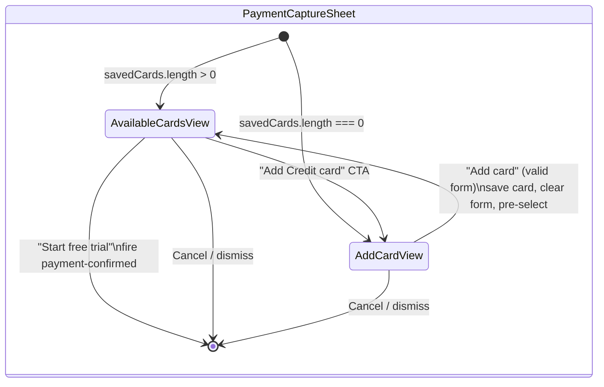

# Design Document: Save Card & Return to Selection

## Overview

This feature changes the "Add card" flow in `PaymentCaptureSheet` so that submitting the add-card form no longer fires `payment-confirmed` immediately. Instead, it:

1. Creates a `SavedCard` from the form data (brand detection, last-four extraction, unique ID).
2. Appends the new card to a local `savedCards` state array.
3. Navigates back to `AvailableCardsView` with the new card pre-selected.
4. Clears the add-card form fields.
5. Lets the user confirm payment only from `AvailableCardsView`.

The change is scoped entirely to `PaymentCaptureSheet.tsx`. No new files are required. The component currently receives `savedCards` via `directive.props` and has no local state for dynamically added cards. We introduce local state that seeds from props and grows as cards are added.

## Architecture



The key architectural change is that `handleAddCard` no longer emits `payment-confirmed`. Instead it:
1. Derives a `SavedCard` from form data via a pure `cardEntryToSavedCard` function.
2. Appends to local state `localSavedCards`.
3. Sets `selectedCardId` to the new card's ID.
4. Resets form fields.
5. Switches `view` to `'available-cards'`.

Payment confirmation remains exclusively in `handleStartFreeTrial` on `AvailableCardsView`.

## Components and Interfaces

### Modified: `PaymentCaptureSheet`

**New local state:**

```typescript
// Seeds from directive.props.savedCards, grows when user adds cards
const [localSavedCards, setLocalSavedCards] = useState<SavedCard[]>(
  Array.isArray(directive.props.savedCards) ? directive.props.savedCards as SavedCard[] : []
);
```

**New pure function: `detectCardBrand`**

```typescript
export function detectCardBrand(cardNumber: string): SavedCard['brand'] {
  const digits = cardNumber.replace(/\s/g, '');
  if (digits.startsWith('34') || digits.startsWith('37')) return 'amex';
  if (/^5[1-5]/.test(digits)) return 'mastercard';
  if (digits.startsWith('4')) return 'visa';
  return 'visa'; // default fallback
}
```

**New pure function: `cardEntryToSavedCard`**

```typescript
export function cardEntryToSavedCard(
  cardNumber: string,
  expiryMonth: number,
  expiryYear: number,
  idGenerator?: () => string,
): SavedCard {
  const digits = cardNumber.replace(/\s/g, '');
  return {
    id: (idGenerator ?? (() => crypto.randomUUID()))(),
    brand: detectCardBrand(digits),
    lastFour: digits.slice(-4),
    expiryMonth,
    expiryYear,
  };
}
```

**Modified: `handleAddCard`**

Instead of emitting `payment-confirmed`, it:
1. Calls `cardEntryToSavedCard` to create a `SavedCard`.
2. Appends to `localSavedCards`.
3. Sets `selectedCardId` to the new card's ID.
4. Clears form fields (`cardNumber`, `expiryDate`, `cvv`, `cardholderName`).
5. Sets `view` to `'available-cards'`.

**Modified: view initial state and card list source**

- `view` initial state uses `localSavedCards.length` instead of the prop-derived `savedCards.length`.
- `AvailableCardsView` receives `localSavedCards` instead of the prop-derived `savedCards`.
- `AddCardView.showBackButton` uses `localSavedCards.length > 0`.

### Unchanged: `AvailableCardsView` and `AddCardView`

These sub-components receive data via props and require no interface changes. The only difference is the data source (local state vs. prop).

## Data Models

### Existing types (no changes)

```typescript
// From src/types/index.ts — unchanged
interface SavedCard {
  id: string;
  brand: 'visa' | 'mastercard' | 'amex';
  lastFour: string;
  expiryMonth: number;  // 1-12
  expiryYear: number;   // 4-digit year
}

interface CardEntryData {
  cardNumber: string;
  expiryMonth: number;
  expiryYear: number;
  cvv: string;
  cardholderName: string;
}
```

### Brand detection mapping

| Prefix | Brand |
|--------|-------|
| `4` | `visa` |
| `51`–`55` | `mastercard` |
| `34`, `37` | `amex` |
| Other | `visa` (default) |

### State transitions

| Action | `localSavedCards` | `selectedCardId` | `view` | Form fields |
|--------|-------------------|-------------------|--------|-------------|
| Mount (has cards) | seed from props | first card ID | `available-cards` | empty |
| Mount (no cards) | `[]` | `null` | `add-card` | empty |
| "Add card" (valid) | append new card | new card ID | `available-cards` | cleared |
| "Add card" (invalid) | unchanged | unchanged | `add-card` | unchanged |
| "Start free trial" | unchanged | unchanged | fires `payment-confirmed` | n/a |


## Correctness Properties

*A property is a characteristic or behavior that should hold true across all valid executions of a system — essentially, a formal statement about what the system should do. Properties serve as the bridge between human-readable specifications and machine-verifiable correctness guarantees.*

### Property 1: Card entry to SavedCard conversion correctness

*For any* valid card number, `cardEntryToSavedCard` SHALL produce a `SavedCard` where:
- `brand` matches the prefix rules: `'amex'` for `34`/`37` prefixes, `'mastercard'` for `51`–`55` prefixes, `'visa'` for `4` prefix, and `'visa'` as default for all other prefixes.
- `lastFour` equals the last four digits of the card number (whitespace stripped).

**Validates: Requirements 1.2, 4.1, 4.2, 4.3, 4.4**

### Property 2: Add card state transition

*For any* valid card form data and any existing saved cards list, when `handleAddCard` is invoked:
- `localSavedCards` length increases by exactly 1.
- `view` transitions to `'available-cards'`.
- `selectedCardId` equals the newly created card's `id`.
- All form fields (`cardNumber`, `expiryDate`, `cvv`, `cardholderName`) are reset to empty strings.
- No `payment-confirmed` interaction event is emitted.

**Validates: Requirements 1.1, 2.1, 2.2, 2.4, 3.1**

### Property 3: Unique ID generation across additions

*For any* sequence of N valid card additions (N ≥ 2), all generated `SavedCard.id` values SHALL be distinct.

**Validates: Requirements 1.3**

### Property 4: Invalid form rejection preserves state

*For any* card form data that fails at least one validation rule (invalid Luhn, empty cardholder name, invalid CVV, invalid expiry), invoking `handleAddCard` SHALL leave `localSavedCards` unchanged and `view` SHALL remain `'add-card'`.

**Validates: Requirements 1.4**

## Error Handling

| Scenario | Behaviour |
|----------|-----------|
| Invalid card form submitted | `handleAddCard` returns early (no-op). View stays on `add-card`. No state mutation. |
| Card number with unrecognised prefix | `detectCardBrand` returns `'visa'` as default. No error thrown. |
| `crypto.randomUUID` unavailable | `cardEntryToSavedCard` accepts an optional `idGenerator` parameter for testability. In production, falls back to `crypto.randomUUID()`. |
| Empty `directive.props.savedCards` | Component initialises `localSavedCards` as `[]` and shows `AddCardView`. |
| Non-array `directive.props.savedCards` | Guarded by `Array.isArray` check — defaults to `[]`. |

The component follows the project's error handling convention: no exceptions thrown to the UI layer. Invalid states result in no-ops.

## Testing Strategy

### Property-Based Tests (fast-check, minimum 100 iterations each)

Property-based tests target the pure functions and state logic extracted from the component:

1. **Property 1** — `detectCardBrand` + `cardEntryToSavedCard`: Generate random card numbers with controlled prefixes. Verify brand and lastFour correctness.
   - Tag: `// Feature: save-card-return-to-selection, Property 1: Card entry to SavedCard conversion correctness`

2. **Property 2** — Add card state transition: Generate random valid form data and random existing card lists. Simulate the add-card logic. Verify all postconditions (list growth, view change, selection, form clear, no payment-confirmed).
   - Tag: `// Feature: save-card-return-to-selection, Property 2: Add card state transition`

3. **Property 3** — Unique IDs: Generate N card additions, collect IDs, verify uniqueness via Set size.
   - Tag: `// Feature: save-card-return-to-selection, Property 3: Unique ID generation across additions`

4. **Property 4** — Invalid form rejection: Generate invalid card data (at least one failing validation), verify state is unchanged.
   - Tag: `// Feature: save-card-return-to-selection, Property 4: Invalid form rejection preserves state`

### Unit / Integration Tests (Vitest + React Testing Library)

Example-based tests for UI rendering and interaction flows:

- **Req 2.3**: After adding a card, verify the AvailableCardsView renders the new card with correct brand label and last four digits.
- **Req 3.2**: With a selected card, tapping "Start free trial" fires `payment-confirmed` with the correct `cardId`.
- **Req 3.3**: Add a new card, select it, confirm — verify `payment-confirmed` fires with the new card's ID (not just prop-provided cards).
- **Req 5.1**: Render with empty `savedCards` — verify `AddCardView` is the initial view.
- **Req 5.2**: With no saved cards, add a card — verify `AvailableCardsView` shows one card, pre-selected.
- **Req 5.3**: After first card add, verify "Start free trial" button is enabled.

### Test Library

- **Runner**: Vitest
- **PBT**: fast-check (already in devDependencies)
- **Component testing**: @testing-library/react (already in devDependencies)
