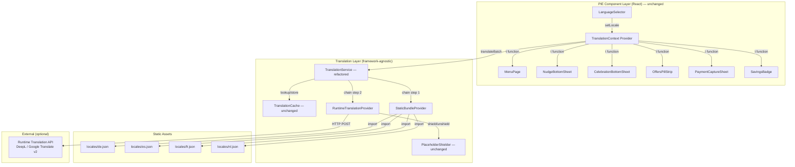
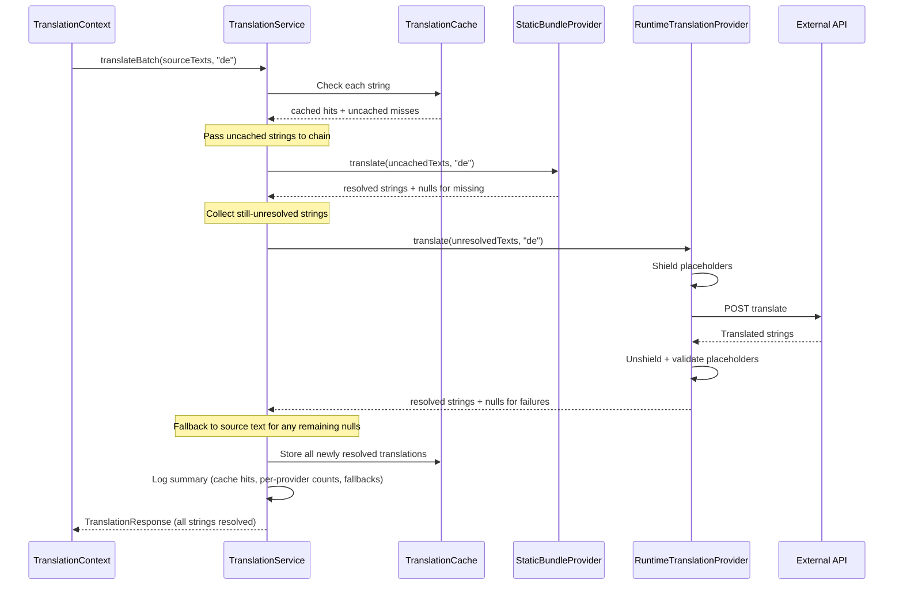

# Design Document: Translation Fallback Layer

## Overview

The Translation Fallback Layer replaces the Gemini generative AI backend inside `TranslationService` with a deterministic, provider-chain architecture. Instead of sending UI strings to an LLM for translation, the system tries an ordered chain of translation providers — starting with pre-translated static JSON bundles (zero latency, zero network), falling back to an optional runtime translation API (DeepL, Google Cloud Translation v2, etc.), and ultimately returning English source text if all providers fail.

Key design decisions:

- **Provider interface abstraction**: A `TranslationProvider` interface decouples the translation backend from the orchestration logic. New providers (e.g., a different API, a database-backed provider) can be added without touching `TranslationService`.
- **Static-first strategy**: Static JSON bundles handle all known UI strings at build time with zero latency. The runtime provider only activates for strings missing from bundles (new strings, dynamic content).
- **Null-based resolution signalling**: Providers return `null` for strings they cannot translate, allowing the chain to pass unresolved strings to the next provider without ambiguity.
- **Same public API**: `TranslationService.translateBatch()` and `clearCache()` signatures are unchanged. `TranslationContext`, `LanguageSelector`, and all PIE components require zero modifications.
- **Existing modules preserved**: `TranslationCache`, `PlaceholderShielder`, `TranslationContext`, and `translateDirectiveProps` remain untouched. Only `TranslationService` internals change.

The translation flow after refactoring:
1. User selects a language via LanguageSelector
2. TranslationContext collects visible strings and calls `translateBatch`
3. TranslationService checks cache first, then passes uncached strings through the provider chain
4. Static bundle provider resolves known strings instantly; runtime provider handles the rest
5. Results are cached and served via `t()`; any unresolved strings fall back to English source text

## Architecture



### Provider Chain Data Flow



## Components and Interfaces

### 1. TranslationProvider Interface (`src/translation/TranslationProvider.ts`) — NEW

The common contract all translation backends implement.

```typescript
export interface TranslationProvider {
  /** Human-readable name for logging and diagnostics */
  readonly name: string;

  /**
   * Translate an array of English source texts to the target locale.
   * Returns a same-length array where each entry is either:
   * - a translated string (provider succeeded for that string)
   * - null (provider cannot translate that string)
   */
  translate(
    sourceTexts: string[],
    targetLocale: string,
  ): Promise<(string | null)[]>;
}
```

### 2. StaticBundleProvider (`src/translation/StaticBundleProvider.ts`) — NEW

Resolves translations from pre-built JSON locale files. Zero network, zero latency.

```typescript
import type { TranslationProvider } from './TranslationProvider';

/**
 * Locale bundle type: a plain object mapping English source text → translated string.
 */
type LocaleBundle = Record<string, string>;

export class StaticBundleProvider implements TranslationProvider {
  readonly name = 'StaticBundle';

  /** Bundles keyed by locale code, loaded at construction time */
  private bundles: Map<string, LocaleBundle>;

  constructor(bundles: Record<string, LocaleBundle>);

  async translate(
    sourceTexts: string[],
    targetLocale: string,
  ): Promise<(string | null)[]>;
}
```

Behaviour:
- Constructor receives a `Record<string, LocaleBundle>` mapping locale codes to their bundle objects (e.g., `{ de: deBundle, es: esBundle, ... }`)
- `translate()` looks up each source text as a key in the locale's bundle; returns the value if found, `null` if not
- If the locale has no bundle loaded, returns `null` for all strings and logs a structured warning
- Bundles are loaded via Vite static imports at the call site that constructs the provider, keeping the provider itself framework-agnostic

### 3. RuntimeTranslationProvider (`src/translation/RuntimeTranslationProvider.ts`) — NEW

Calls an external translation API for strings not resolved by earlier providers.

```typescript
import type { TranslationProvider } from './TranslationProvider';

export interface RuntimeProviderConfig {
  apiEndpoint: string;   // e.g., "https://api-free.deepl.com/v2/translate"
  apiKey: string;
  timeoutMs?: number;    // default: 10000
}

export class RuntimeTranslationProvider implements TranslationProvider {
  readonly name = 'RuntimeAPI';

  constructor(config: RuntimeProviderConfig);

  async translate(
    sourceTexts: string[],
    targetLocale: string,
  ): Promise<(string | null)[]>;
}
```

Behaviour:
- Shields placeholders and currency values via `PlaceholderShielder` before sending to the API
- Unshields after receiving translations
- Validates placeholder preservation; returns `null` for any string where tokens are missing
- Returns `null` for all strings on API failure/timeout, with structured warning log
- Uses `AbortController` with configurable timeout (default 10s)
- API-agnostic: the `apiEndpoint` and request format are configurable. The default implementation targets a generic REST translation API shape, but the class can be subclassed or configured for DeepL, Google Cloud Translation v2, etc.

### 4. TranslationService (`src/translation/TranslationService.ts`) — REFACTORED

The public API is unchanged. Internals are replaced with provider chain orchestration.

```typescript
import type { TranslationProvider } from './TranslationProvider';
import type { TranslationRequest, TranslationResponse } from '../types';

export interface TranslationServiceConfig {
  providers: TranslationProvider[];
  // apiKey and modelName removed — no longer needed
}

export class TranslationService {
  constructor(config: TranslationServiceConfig);

  /**
   * Same public contract as before.
   * Internally: cache check → provider chain → fallback to source text.
   */
  translateBatch(request: TranslationRequest): Promise<TranslationResponse>;

  /** Clear all cached translations. */
  clearCache(): void;
}
```

Orchestration logic inside `translateBatch`:
1. If `targetLocale === 'en'`, return source texts unchanged (no cache writes, no provider calls)
2. Check `TranslationCache` for each source text; separate hits from misses
3. If all cached, return immediately
4. Pass uncached texts to provider chain:
   - For each provider in order, call `translate()` with the currently unresolved texts
   - Collect resolved strings; filter down to still-unresolved for the next provider
   - If a provider throws, catch the error, log it, and continue to the next provider
5. For any strings still unresolved after all providers, use the original source text
6. Store all newly resolved translations in cache
7. Log a structured summary: total requested, cache hits, resolved per provider, fallbacks
8. Return the complete `TranslationResponse`

### 5. Existing Modules — UNCHANGED

- **TranslationCache** (`src/translation/TranslationCache.ts`): Same in-memory `Map<string, string>` keyed by `${locale}::${sourceText}`.
- **PlaceholderShielder** (`src/translation/PlaceholderShielder.ts`): Same shield/unshield/validate functions. Now used by `RuntimeTranslationProvider` instead of `TranslationService` directly.
- **TranslationContext** (`src/translation/TranslationContext.tsx`): Same React context provider. Receives a `TranslationService` instance via props — the service's internal change is invisible.
- **LanguageSelector** (`src/pie/LanguageSelector.tsx`): No changes.
- **translateDirectiveProps** (`src/translation/translateDirectiveProps.ts`): No changes.

### 6. Static Bundle Generation Utility (`scripts/extract-translations.ts`) — NEW

A Node.js script that scans `src/` for `t()` call sites, extracts source text arguments, and generates/updates locale JSON skeleton files.

```typescript
/**
 * Scans all .ts/.tsx files under src/ for t('...') and t("...") calls.
 * For each non-English locale, outputs src/translation/locales/{locale}.json
 * with source text keys. Preserves existing translated values; adds new keys
 * with empty string values.
 *
 * Usage: npx tsx scripts/extract-translations.ts
 * Or via npm script: npm run extract-translations
 */
```

Behaviour:
- Uses regex or simple AST parsing to find `t('...')` and `t("...")` patterns
- Reads existing locale JSON files if present; merges new keys without overwriting existing translations
- Outputs formatted JSON with sorted keys for clean diffs
- Supports all non-English locales: `de`, `es`, `fr`, `nl`

### 7. Factory Function (`src/translation/createTranslationService.ts`) — NEW

A convenience factory that wires up the provider chain with environment-based configuration.

```typescript
import { TranslationService } from './TranslationService';

/**
 * Creates a TranslationService with the standard provider chain:
 * 1. StaticBundleProvider (always)
 * 2. RuntimeTranslationProvider (only if VITE_TRANSLATION_API_KEY is set)
 *
 * Reads from environment variables:
 * - VITE_TRANSLATION_API_ENDPOINT (optional, for runtime provider)
 * - VITE_TRANSLATION_API_KEY (optional, enables runtime provider)
 */
export function createTranslationService(): TranslationService;
```

## Data Models

### TranslationProvider Interface

```typescript
interface TranslationProvider {
  readonly name: string;
  translate(sourceTexts: string[], targetLocale: string): Promise<(string | null)[]>;
}
```

### Static Bundle JSON Format

Each locale file at `src/translation/locales/{locale}.json`:

```json
{
  "Save {{fee}} on delivery": "Sparen Sie {{fee}} bei der Lieferung",
  "Free delivery with {{plan}}": "Kostenlose Lieferung mit {{plan}}",
  "Add to basket": "In den Warenkorb"
}
```

Keys are English source texts (exactly as passed to `t()`). Values are translated strings. Empty string values indicate untranslated entries awaiting population.

### TranslationServiceConfig (updated)

```typescript
// Old (Gemini-coupled):
interface TranslationServiceConfig {
  apiKey: string;
  timeoutMs?: number;
  modelName?: string;
}

// New (provider-chain):
interface TranslationServiceConfig {
  providers: TranslationProvider[];
}
```

### RuntimeProviderConfig

```typescript
interface RuntimeProviderConfig {
  apiEndpoint: string;
  apiKey: string;
  timeoutMs?: number;  // default: 10000
}
```

### Existing Types — UNCHANGED

- `Locale`, `TranslationRequest`, `TranslationResponse` in `src/types/index.ts` — no changes
- `ShieldResult` in `PlaceholderShielder.ts` — no changes
- `TranslationContextValue` in `TranslationContext.tsx` — no changes


## Correctness Properties

*A property is a characteristic or behavior that should hold true across all valid executions of a system — essentially, a formal statement about what the system should do. Properties serve as the bridge between human-readable specifications and machine-verifiable correctness guarantees.*

### Property 1: Output length invariant

*For any* array of source texts and any target locale, calling `translateBatch` on the TranslationService SHALL return a `translations` array whose length equals the input `sourceTexts` array length, regardless of which providers succeed or fail.

**Validates: Requirements 1.3, 4.5, 9.4**

### Property 2: Static bundle lookup correctness

*For any* locale bundle (a mapping of English keys to translated values) and any array of source texts, the StaticBundleProvider SHALL return the translated value for each source text that exists as a key in the bundle, and `null` for each source text not present in the bundle.

**Validates: Requirements 2.2, 2.4**

### Property 3: Provider chain cascading

*For any* ordered pair of providers where the first provider returns `null` for a subset of strings, the TranslationService SHALL pass exactly those null-result strings (and no others) to the second provider.

**Validates: Requirements 4.3**

### Property 4: Unresolved strings fall back to source text

*For any* array of source texts and a target locale, when all providers in the chain return `null` for a given string, the final `translations` output SHALL contain the original English source text for that string.

**Validates: Requirements 4.4**

### Property 5: Cache round-trip

*For any* locale, source text, and translation string, storing a translation in the TranslationCache and then retrieving it with the same `(locale, sourceText)` key SHALL return the identical translation string.

**Validates: Requirements 5.5**

### Property 6: Cache integration with provider chain

*For any* set of source texts where some are already cached for the target locale, the TranslationService SHALL invoke the provider chain only for uncached strings, and all newly resolved translations SHALL be stored in the cache for subsequent lookups.

**Validates: Requirements 5.2, 5.4**

### Property 7: Placeholder and currency token preservation

*For any* source text containing `{{key}}` placeholder tokens and/or currency values (e.g., `£3.99`, `€5.00`), translating to any supported locale through the TranslationService SHALL produce output containing the exact same set of placeholder tokens and currency values. If a provider returns a translation missing any token, the service SHALL discard it and return the original source text.

**Validates: Requirements 6.1, 6.2, 6.3, 6.4, 3.7**

### Property 8: English locale pass-through

*For any* array of source texts, when the target locale is `"en"`, the TranslationService SHALL return each source text unchanged, invoke zero providers, and write zero entries to the cache.

**Validates: Requirements 8.1, 8.2, 8.3**

### Property 9: Bundle merge preserves existing translations

*For any* existing locale JSON bundle with translated values and any set of newly extracted source text keys, the bundle generation utility SHALL preserve all existing key-value pairs unchanged and add only new keys with empty string values.

**Validates: Requirements 7.3**

### Property 10: Provider error resilience

*For any* provider chain where one provider throws an unexpected error, the TranslationService SHALL catch the error and continue to the next provider in the chain, ultimately returning a valid `TranslationResponse` with no unhandled exceptions.

**Validates: Requirements 10.4**

## Error Handling

| Scenario | Behaviour | User Impact |
|----------|-----------|-------------|
| Static bundle missing for locale | StaticBundleProvider returns `null` for all strings; logs structured warning with locale | Runtime provider handles translation; user sees translated text (slower) or English fallback |
| Runtime API timeout (>10s) | AbortController cancels request; RuntimeTranslationProvider returns `null` for all strings; logs warning | User sees English text for uncovered strings |
| Runtime API HTTP error (4xx/5xx) | RuntimeTranslationProvider returns `null` for all strings; logs warning with status code | User sees English text for uncovered strings |
| Runtime API returns wrong array length | RuntimeTranslationProvider returns `null` for all strings; logs warning | User sees English text for uncovered strings |
| Translation missing placeholders | Provider returns `null` for that string; TranslationService falls back to source text; logs missing tokens | User sees English for that string; other translations unaffected |
| Provider throws unexpected error | TranslationService catches error, logs structured error with provider name, continues to next provider | Transparent to user — next provider or fallback handles it |
| No providers configured | TranslationService returns source texts for all strings | App works fully in English |
| `VITE_TRANSLATION_API_KEY` not set | RuntimeTranslationProvider not added to chain; only StaticBundleProvider active | Static bundle translations work; uncovered strings show in English |
| Network offline | RuntimeTranslationProvider fetch rejects; same as timeout handling | Static bundle translations still work; uncovered strings show in English |
| All providers return null for a string | TranslationService uses source text as fallback; logs warning | User sees English for that string |

All error paths follow the existing convention: never throw to the UI layer. Errors result in graceful fallback to English source text with structured console warnings.

## Testing Strategy

### Property-Based Tests (fast-check, minimum 100 iterations each)

Each property from the Correctness Properties section maps to one property-based test:

| Test | Property | Module Under Test |
|------|----------|-------------------|
| Output length invariant | Property 1 | TranslationService |
| Static bundle lookup correctness | Property 2 | StaticBundleProvider |
| Provider chain cascading | Property 3 | TranslationService |
| Unresolved strings fall back to source text | Property 4 | TranslationService |
| Cache round-trip | Property 5 | TranslationCache |
| Cache integration with provider chain | Property 6 | TranslationService |
| Placeholder and currency token preservation | Property 7 | TranslationService + PlaceholderShielder |
| English locale pass-through | Property 8 | TranslationService |
| Bundle merge preserves existing translations | Property 9 | extract-translations script |
| Provider error resilience | Property 10 | TranslationService |

Tag format: `// Feature: translation-fallback-layer, Property {N}: {title}`

Library: `fast-check` (already in devDependencies)

### Unit Tests (Vitest)

- **StaticBundleProvider**: loads bundles, returns null for missing locale, returns null for missing keys, handles empty input array
- **RuntimeTranslationProvider**: calls API with correct format, handles timeout, handles HTTP errors, shields/unshields placeholders, validates placeholder preservation, returns null on failure
- **TranslationService (refactored)**: accepts provider array, checks cache before providers, logs summary after batch, English locale returns source texts without provider calls, clearCache works
- **createTranslationService factory**: creates service with static provider only when no API key, creates service with both providers when API key is set
- **extract-translations script**: extracts `t()` calls from sample source, generates correct JSON structure, preserves existing translations on re-run

### Integration Tests

- **TranslationContext + refactored TranslationService**: change locale, verify all text elements update via `t()`
- **Backward compatibility**: existing TranslationContext tests pass without modification against the new TranslationService
- **NudgeEvent flow**: emit event → translate via provider chain → render in NudgeBottomSheet

### Mocking Strategy

- Runtime API calls are mocked in all unit and property tests using `vi.fn()` or `vi.spyOn(globalThis, 'fetch')`
- `TranslationProvider` implementations are mocked with `vi.fn()` for TranslationService chain tests
- StaticBundleProvider receives in-memory bundle objects in tests (no file I/O)
- TranslationService is injectable into TranslationContext for test isolation
- No real external API calls in CI — all tests use deterministic mock responses
